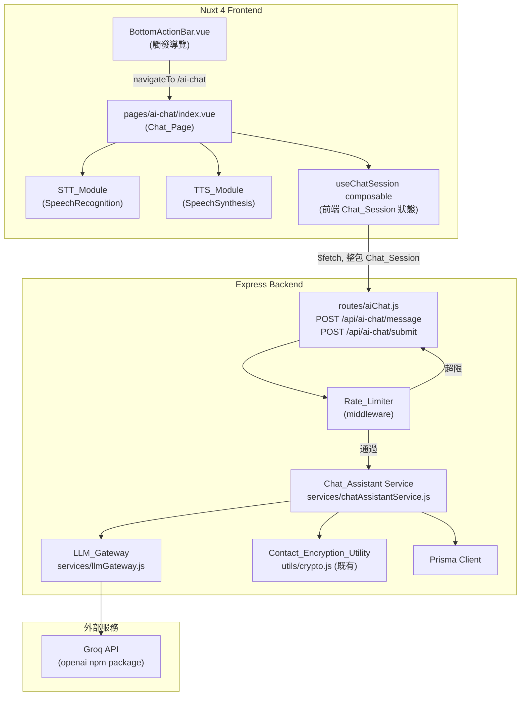

# Design Document

## Overview

「AI 智能表單助手」在既有 Nuxt 4 + Express/Prisma 架構上新增一條獨立的對話式助手體驗。使用者從 `BottomActionBar.vue` 的「AI 聊天」按鈕導覽至新的 `pages/ai-chat/index.vue` 頁面（取代原 `AiChatOverlay.vue` 覆蓋層），在該頁面內可用文字或語音（瀏覽器原生 Web Speech API）與助手互動。助手後端（`Chat_Assistant`）協調三件事：

1. **意圖判斷／表單比對**：將使用者描述比對到 `pms_form` 中的合適表單，或判斷為一般問答。
2. **對話式填表**：依 `PmsFormGroup` → `PmsFormTopic` 順序逐題引導，抽取欄位值、驗證、彙總、送出。
3. **模型與流量治理**：透過 `LLM_Gateway` 呼叫 Groq（`Fast_Model` / `Smart_Model`），處理信心分數升級、429 重試/降級；透過 `Rate_Limiter` 限制呼叫頻率。

對話狀態（`Chat_Session`）在 MVP 階段採**無伺服器端持久化**設計：後端以「無狀態 API + 前端保存完整對話狀態、每次請求整包送回」的方式運作（詳見 Architecture 決策）。這避開了「新增 session 儲存表/快取層」這類超出既有 schema 範圍的基礎設施決策，同時仍能滿足 Requirement 3/4 對狀態轉換與保留的要求。

聯絡資訊欄位的加解密**必須**重用 `backend/utils/crypto.js` 現有的 `encryptField` / `decryptField` / `hashEmail`，不新增任何自製加密邏輯。

### 待確認事項的設計決策（MVP 暫行方案）

以下針對 requirements.md 的「Assumptions and Open Questions」逐項給出 MVP 暫行決策，實作前仍建議與專案負責人確認（已標註於各段落）：

| # | 開放問題 | MVP 暫行決策 |
|---|---|---|
| 1 | `pms_form.type`/`subType`、`pms_form_topic.type` 代碼表 | 後端新增 `backend/constants/formCodes.js` 定義暫行代碼常數（文字=`01`、數字=`02`、單選=`03`、多選=`04`、日期=`05`、上傳圖片=`06`），集中管理，**待與現有前端表單頁面程式碼核對後修正**。 |
| 2 | `feedbackNo` 產生規則 | 由後端產生 `YYYYMMDD` + 8 碼隨機 base36（共 16 碼），寫入前查詢資料庫確保唯一（碰撞則重新產生，最多重試 5 次）。**正式規則待確認**。 |
| 3 | `serviceId` 來源 | MVP 以 `PmsForm.serviceVendorId` 反查 `CmsHomepageServiceVendor`→`CmsHomepageService`，取第一筆符合的 `service.id`；查無對應時使用可設定的預設值（環境變數 `AI_CHAT_DEFAULT_SERVICE_ID`）。**待確認正式對應關係**。 |
| 4 | `platformCode` 值 | 新增代碼 `"09"` 代表「AI 聊天助手」管道（環境變數 `AI_CHAT_PLATFORM_CODE` 可覆寫，預設 `09`）。**待確認正式代碼值**。 |
| 5 | 未登入使用者 | 允許未登入使用者問答與填表對話；送出（寫入 `PmsFormFeedback`）前呼叫既有 `verifyToken` 中介層檢查，未登入回 401，前端提示登入並保留已收集欄位（存於前端 state，不因 401 清空）。 |
| 6 | 非 email 雜湊欄位演算法 | MVP 暫行方案：`contactMobileHash`／`contactLandlineHash`／`contactAddressDetailHash` 沿用與 `hashEmail` 相同的 SHA-256 正規化規則（trim 後取 SHA-256 hex），實作為 `hashContactField(value)` 通用函式（放在 `backend/utils/crypto.js` 或新增 `hashGeneric` 匯出，不改變既有 `hashEmail` 行為）。**待確認是否與既有其他模組的雜湊規則一致**。 |
| 7 | `isRead`/`status` 初始值 | 新建紀錄 `isRead = "0"`（未讀）、`status = "01"`（待處理）。**待確認正式代碼表**。 |
| 8 | 縣市/區域限制 | MVP 完全跳過 `PmsTopicCountyDistrictRelation` 檢查邏輯，題目一律視為不受地區限制。 |
| 9 | Chat_Page 路由 / `AiChatOverlay.vue` 去留 | 新增路由 `frontend/app/pages/ai-chat/index.vue`。`AiChatOverlay.vue` 由 `BottomActionBar.vue` 移除引用（不再掛載），檔案本身保留但標記為未使用／後續清理，避免這次變更外的破壞性刪除。`BottomActionBar.vue` 的 `openAiChat()` 改為 `navigateTo('/ai-chat')`。 |

## Architecture

### 整體架構圖



### 關鍵架構決策

**決策 1：Chat_Session 狀態存放於前端，後端無狀態。**
理由：現有 schema 沒有「對話 session」表，新增資料表/Redis 等基礎設施超出本次需求範圍且缺乏必要性（單次對話生命週期短）。前端在 `useChatSession` composable 中持有完整狀態（`selectedFormId`、`collectedFields`、`messages`、`pendingTopicId` 等），每次呼叫 `POST /api/ai-chat/message` 時將目前狀態整包送出，後端純函式式地計算下一狀態並回傳，前端覆寫本地狀態。此設計让 `Chat_Session` 的狀態轉換成為可測試的純函式（`applyMessage(session, userInput, llmResponse) -> newSession`），非常適合 property-based testing。
風險：前端可竄改送出的 `collectedFields`（例如偽造已確認欄位）。緩解：後端在送出（`/submit`）前，對照 `PmsFormTopic` 定義重新驗證所有必填欄位與格式限制（Requirement 4.4/4.5 的驗證邏輯在送出前必再次執行一次，不僅信任前端狀態）。

**決策 2：Chat_Page 轉場效果使用 Nuxt `pageTransition` + CSS clip-path 動畫，而非 View Transitions API。**
理由：View Transitions API 目前瀏覽器支援度不一致（Safari 支援較晚），且 Nuxt 原生 `definePageMeta({ pageTransition })` 搭配 Vue `<Transition>` 已足以做出「下方色塊往上擴張填滿」效果，實作與相容性成本較低。`prefers-reduced-motion` 透過 CSS media query 直接關閉動畫類別（`transition: none`），符合 Requirement 10.4，不需 JS 判斷（更可靠、SSR 友善）。

**決策 3：LLM_Gateway 封裝 429 重試與降級為單一可測試函式。**
`callWithFallback({ task, fastFirst })` 純邏輯（重試次數、間隔、降級判斷）與實際 HTTP 呼叫（`openai` SDK）分離，讓重試/降級序列可用 mock 呼叫進行單元測試與 property test，不必真的打 Groq API。

## Components and Interfaces

### Frontend

**`frontend/app/pages/ai-chat/index.vue`（Chat_Page）**
- `definePageMeta({ pageTransition: { name: 'chat-fill', mode: 'out-in' } })`
- 內部組合既有 `AiChatOverlay.vue` 的訊息呈現/輸入區塊 UI（重構為頁面內容，不再是覆蓋層），並掛載 `STT_Module`、`TTS_Module`、`useChatSession`。
- 返回/關閉操作呼叫 `navigateTo` 回上一頁（`useRouter().back()` 或固定回首頁，若無 history 則導回 `/`）。

**`frontend/app/composables/useChatSession.ts`**
- 管理前端 `Chat_Session` 狀態物件、呼叫 `/api/ai-chat/message`、`/api/ai-chat/submit`。
- 導出純函式 `createInitialSession()`、`isAwaitingFormSwitch(session)` 等供元件與測試使用。

**`frontend/app/composables/useSpeechRecognition.ts`（STT_Module）**
- 封裝 `window.SpeechRecognition`/`webkitSpeechRecognition` 特徵檢測、60 秒逾時計時器、5 秒無語音偵測計時器、錯誤事件處理。
- 回傳 `{ isSupported, isListening, start, stop, transcript, error }`。

**`frontend/app/composables/useSpeechSynthesis.ts`（TTS_Module）**
- 封裝 `window.speechSynthesis`，管理「目前播放中的 utterance id」以確保同一時間只播放一則（滿足 Requirement 2.2 的互斥要求）。
- 回傳 `{ isSupported, playingMessageId, speak(id, text), stop() }`。

**`frontend/app/components/nav/BottomActionBar.vue`（修改）**
- `openAiChat()` 改為 `navigateTo('/ai-chat')`，移除 `showAiChat` ref 與 `<ChatAiChatOverlay>` 掛載。

### Backend

**`backend/routes/aiChat.js`**
- `POST /api/ai-chat/message`：接收 `{ session, userInput, inputMode }`，通過 `Rate_Limiter` 中介層與輸入驗證（長度/禁用內容，Requirement 1.6-1.7、9.5-9.6），呼叫 `chatAssistantService.handleMessage`，回傳 `{ session, replyText, replyMeta }`。
- `POST /api/ai-chat/submit`：接收 `{ session }`，需通過 `verifyToken`（可選中介層，未登入時仍放行到 service 內部判斷，回覆結構化 401 語意的業務錯誤，而非中介層硬性擋掉，因為 Requirement 6.2 要求「保留已收集欄位」的使用者體驗，由 service 層統一處理更清楚）。

**`backend/middleware/aiChatRateLimiter.js`（Rate_Limiter）**
- In-memory `Map<identifier, { count, windowStart }>`（MVP 不需跨進程共享；單一 Node process）。
- 識別碼：已登入用 `req.user.sub`（若 `verifyToken` 可選驗證出使用者），否則用 `req.ip`。
- 讀取環境變數 `AI_CHAT_RATE_WINDOW_SECONDS`（預設 60）、`AI_CHAT_RATE_MAX_CALLS`（預設 20）。
- 核心邏輯抽成純函式 `checkAndConsume(state, identifier, now, windowSeconds, maxCalls) -> { allowed, state, retryAfterSeconds }`，供 property test 使用，不依賴 Express req/res。

**`backend/services/llmGateway.js`（LLM_Gateway）**
- `callFastModel(messages)` / `callSmartModel(messages)`：使用 `openai` SDK，`baseURL: 'https://api.groq.com/openai/v1'`，`apiKey: process.env.GROQ_API_KEY`。
- `requestStructuredResponse({ messages, forceSmart })`：
  1. 呼叫 Fast_Model（除非 `forceSmart`）。
  2. 若信心分數 < `AI_CHAT_CONFIDENCE_THRESHOLD`（預設 0.6），改呼叫 Smart_Model。
  3. 任一模型收到 429：重試（純函式 `retryWithBackoff`，最多 3 次、間隔 ≥500ms，可測試時注入假 clock/sleep）。
  4. Smart_Model 重試耗盡仍 429 → 降級呼叫 Fast_Model。
  5. Fast_Model 重試耗盡仍 429 → 拋出 `ServiceBusyError`，由上層轉為「服務忙碌」訊息，不清除 session。
- `parseStructuredResponse(rawContent)`：將 LLM 回傳字串 parse 為 `Structured_Response`（`action`、`matched_form_id`、`reply_text`、`collected_fields`、`confidence`），parse 失敗時回傳 `{ action: 'error' }`，交由呼叫端視為呼叫失敗處理（對應 Requirement 4.9）。

**`backend/services/chatAssistantService.js`（Chat_Assistant）**
- `handleMessage(session, userInput, inputMode)`：核心分派邏輯：
  - 若 `session.selectedFormId` 為 null → 呼叫 LLM 做表單比對／問答判斷（Requirement 3、5）。
  - 若已選定表單且非 pending 表單切換確認 → 依目前題目呼叫欄位擷取（Requirement 4）。
  - 若 `session.pendingFormSwitch` 存在 → 解析使用者是否確認切換（Requirement 3.6-3.8）。
  - 一律允許使用者插話問答（Requirement 4.8）：透過 LLM 回傳 `action` 判斷。
- `buildFormFeedbackPayload(session, userId)`：組合 `feedbackContent`（排除聯絡資訊欄位）、呼叫 `encryptField`/`hashContactField`/`hashEmail` 產生聯絡資訊 Bytes/Hash 欄位、決定 `serviceId`/`platformCode`/`feedbackNo`/`isRead`/`status`。
- `submitFeedback(session, userId)`：在單一 Prisma 呼叫內建立 `PmsFormFeedback`（Prisma 本身於單一 `create` 呼叫已具原子性，無需額外 `$transaction`），任何欄位驗證/加密錯誤或資料庫寫入錯誤皆需在呼叫 `prisma.pmsFormFeedback.create` 之前完成資料組裝與驗證，確保失敗時不產生部分寫入（Requirement 6.5）。

**`backend/services/formMatchingService.js`**
- `listActiveForms()`：查詢 `pms_form` where `isEnable = '1' AND isDeleted = '0'`，回傳 `{ id, name, introContent }` 精簡清單供 LLM prompt 使用。
- `getFormWithTopics(formId)`：查詢表單、`PmsFormGroup`（依 `sort`）、其下 `PmsFormTopic`（依 `sort`）、`PmsTopicOption`。
- `validateAnswerAgainstTopic(topic, rawAnswer)`：純函式，依 `topic.type` 與限制條件（`PmsTopicOption` 清單、`minimumMediasUpload`/`maximumMediasUpload`、`startDateOffsetDays`/`endDateOffsetDays`）驗證答案，回傳 `{ valid, normalizedValue, errorMessage }`。此為高價值 property test 對象。

## Data Models

沿用既有 Prisma models（`PmsForm`、`PmsFormGroup`、`PmsFormTopic`、`PmsTopicOption`、`PmsTopicMedia`、`PmsTopicCountyDistrictRelation`、`PmsFormFeedback`、`MemberAccount`），**不修改 schema**。

### Chat_Session（前端狀態物件，非資料庫模型）

```typescript
interface ChatSession {
  selectedFormId: number | null;
  pendingFormSwitch: { newFormId: number } | null; // Requirement 3.6-3.8
  collectedFields: Record<string, FieldValue>; // key = PmsFormTopic.id
  currentTopicId: number | null; // 目前引導中的題目
  awaitingSubmitConfirmation: boolean; // Requirement 4.6-4.7
  messages: ChatMessage[]; // 對話歷史（供 UI 呈現與 LLM context）
  stage: 'selecting_form' | 'filling' | 'confirming' | 'submitted';
}

interface FieldValue {
  topicId: number;
  value: string | string[] | number; // 依題目 type 而定
}

interface ChatMessage {
  id: string;
  role: 'user' | 'assistant';
  text: string;
  createdAt: string; // ISO timestamp
}
```

### Structured_Response（LLM_Gateway 輸出）

```typescript
interface StructuredResponse {
  action: 'match_form' | 'need_clarification' | 'answer_question' | 'extract_field' | 'confirm_switch' | 'error';
  matched_form_id?: number | null;
  reply_text: string;
  collected_fields?: Record<string, string | string[] | number>;
  confidence: number; // 0..1
}
```

### PmsFormFeedback 寫入映射

| Chat_Assistant 資料來源 | PmsFormFeedback 欄位 |
|---|---|
| 非聯絡資訊之 `collectedFields` | `feedbackContent` (JSON) |
| MVP 暫行決策 #3 | `serviceId` |
| MVP 暫行決策 #4 | `platformCode` |
| `session.selectedFormId` | `formId` |
| `PmsForm.type` | `formType` |
| MVP 暫行決策 #7 | `isRead`, `status` |
| `encryptField(contactName)` | `contactName` (Bytes) |
| `hashContactField(contactName)` | `contactNameHash` |
| `encryptField(contactMobile)`（若提供） | `contactMobile` |
| `hashContactField(contactMobile)`（若提供） | `contactMobileHash` |
| `encryptField(contactLandline)`（若提供） | `contactLandline` |
| `hashContactField(contactLandline)`（若提供） | `contactLandlineHash` |
| `encryptField(contactEmail)`（若提供） | `contactEmail` |
| `hashEmail(contactEmail)`（若提供） | `contactEmailHash` |
| 直接代碼值 | `contactAddressCounty`, `contactAddressDistrict` |
| `encryptField(contactAddressDetail)`（若提供） | `contactAddressDetail` |
| `hashContactField(contactAddressDetail)`（若提供） | `contactAddressDetailHash` |
| MVP 暫行決策 #2 | `feedbackNo` |
| `req.user.sub`（已登入使用者） | `inbrAccountId` |

## Correctness Properties

*A property is a characteristic or behavior that should hold true across all valid executions of a system-essentially, a formal statement about what the system should do. Properties serve as the bridge between human-readable specifications and machine-verifiable correctness guarantees.*

以下屬性均針對後端/前端**純函式邏輯**（狀態轉換、驗證、加解密、重試、計數），與外部服務（Groq API 實際網路呼叫、資料庫實際 I/O）解耦後撰寫，測試時以 mock 取代外部呼叫。

### Property 1: STT 監聽狀態機終將恢復可用

*For any* 由 idle 狀態出發的「啟動聆聽 → (辨識結果 | 逾時 | 錯誤 | 手動停止)」事件序列，STT_Module 的狀態在每個事件序列結束後都會回到 `idle`（可再次啟動），且在任一時刻只會處於 `idle` 或 `listening` 其中一種狀態。

**Validates: Requirements 1.3**

### Property 2: 輸入文字驗證閘門

*For any* 字串輸入，若其長度超過 500 字元或包含不允許內容（HTML 標籤或程式碼片段特徵），驗證函式應回傳「不允許」，且原始輸入字串在驗證前後保持不變、不會被送往 Chat_Assistant；反之若字串通過驗證，應回傳「允許」。

**Validates: Requirements 1.6, 1.7**

### Property 3: TTS 播放互斥狀態機

*For any* 一系列針對任意訊息 ID 的「播放」「停止」「自然結束」「播放錯誤」事件序列，任一時刻最多只有一個 `playingMessageId` 為非 null；點擊已在播放的訊息會使其停止並讓 `playingMessageId` 變為 null；播放另一則訊息會先使先前的 `playingMessageId` 變為該新訊息 ID（原播放訊息視為已停止）。

**Validates: Requirements 2.2, 2.3, 2.4, 2.6**

### Property 4: 可選表單清單即為啟用未刪除之子集合

*For any* `pms_form` 資料集合，`listActiveForms()` 回傳的表單集合，恰好等於該資料集合中 `isEnable === '1' && isDeleted === '0'` 的子集合（不多、不少）。

**Validates: Requirements 3.1**

### Property 5: 表單比對結果套用規則

*For any* Chat_Session（尚未選定表單）與任意 `matched_form_id` 及任意有效表單 ID 集合：若 `matched_form_id` 存在於該集合中，套用後 `session.selectedFormId` 應等於 `matched_form_id`；若不存在於集合中（含 null），套用後 `session.selectedFormId` 應保持為 null。

**Validates: Requirements 3.2, 3.3, 3.4**

### Property 6: 非推進動作保持 Chat_Session 階段不變

*For any* Chat_Session（任一 `stage`）與任意 `action` 為 `need_clarification` 或 `answer_question` 的 Structured_Response（包含 `reply_text` 為空字串的情形），套用該回應後 `session.stage` 應與套用前完全相同。

**Validates: Requirements 3.5, 5.1, 5.2, 5.5**

### Property 7: 表單切換需經確認且不立即變更已收集欄位

*For any* Chat_Session（已選定表單 A，且 `collectedFields` 非空）與比對到相異表單 B 的結果，套用後 `session.selectedFormId` 仍應為 A、`session.collectedFields` 應維持不變，且 `session.pendingFormSwitch` 應被設定為指向 B。

**Validates: Requirements 3.6**

### Property 8: 表單切換確認決策

*For any* Chat_Session 處於 `pendingFormSwitch` 指向表單 B 的狀態，且 `collectedFields` 非空：若使用者訊息被判定為「確認切換」，套用後 `session.selectedFormId` 應等於 B 且 `session.collectedFields` 應為空集合；若判定為「拒絕」或「未明確回覆」，套用後 `session.selectedFormId` 應保持為原表單、`session.collectedFields` 應與套用前完全相同。

**Validates: Requirements 3.7, 3.8**

### Property 9: 下一題選擇規則

*For any* 一組 `PmsFormTopic`（含各自 `sort` 值與所屬 group 的 `sort` 值）與任意已回答子集合，`selectNextTopic()` 回傳的題目應是「未回答題目中，依 group.sort 再依 topic.sort 排序後的最小者」；若所有題目皆已回答，應回傳 null。

**Validates: Requirements 4.1**

### Property 10: 欄位擷取成功時更新、失敗時保留

*For any* Chat_Session 與任意既有 `collectedFields`：當欄位擷取呼叫成功並回傳有效值時，套用後 `collectedFields` 應包含該筆新值（其餘既有欄位不變）；當欄位擷取呼叫逾時或失敗時，套用後 `collectedFields` 應與套用前完全相同（不遺失任何既有欄位）。

**Validates: Requirements 4.3, 4.9**

### Property 11: 答案驗證正確反映題目限制條件

*For any* `PmsFormTopic` 定義（含 `type`、`isRequired`、關聯 `PmsTopicOption` 清單、`minimumMediasUpload`/`maximumMediasUpload`、`startDateOffsetDays`/`endDateOffsetDays`）與任意候選答案：`validateAnswerAgainstTopic()` 回傳「有效」時，該答案必定符合對應題型的格式與所有已定義限制（在選項清單內／媒體數量落在範圍內／日期落在允許區間內）；回傳「無效」時，該答案必定違反至少一項限制或格式；當 `isRequired === '1'` 且答案為「跳過」時，一律回傳「無效」。

**Validates: Requirements 4.4, 4.5**

### Property 12: 必填欄位完整度決定摘要階段

*For any* 表單的 `PmsFormTopic` 集合與任意 `collectedFields`：當且僅當所有 `isRequired === '1'` 的題目皆存在有效值時，完整度判斷函式回傳「已完整」，Chat_Session 套用後 `stage` 應轉為 `confirming`；否則 `stage` 不應轉為 `confirming`。使用者於 `confirming` 階段要求修改後，`stage` 應轉回對應題目引導，且在新一輪收集完整後應能再次轉為 `confirming`。

**Validates: Requirements 4.6, 4.7**

### Property 13: 離題問答不移動題目指標

*For any* Chat_Session 處於填表流程中（`currentTopicId` 為某值）與任意一則被判定為「與填表無關」的使用者訊息，套用該訊息的問答回應前後，`session.currentTopicId` 應保持不變。

**Validates: Requirements 4.8**

### Property 14: feedbackContent 恰好排除聯絡資訊欄位

*For any* `collectedFields` 集合（可能包含以 `contactName`/`contactMobile`/`contactLandline`/`contactEmail`/`contactAddressDetail` 為鍵的項目），`buildFeedbackContent()` 產生的 `feedbackContent` 恰好等於原集合中移除上述 5 個鍵之後的子集合。

**Validates: Requirements 6.1**

### Property 15: 未登入送出被拒且不清空已收集欄位

*For any* Chat_Session（任意非空 `collectedFields`）與「使用者未登入」情境，送出操作的結果必為拒絕，且拒絕前後 `session.collectedFields` 完全相同。

**Validates: Requirements 6.2**

### Property 16: 聯絡資訊加解密往返與未提供值的 null 處理

*For any* 非空字串明文，`decryptField(encryptField(plainText))` 應等於原字串；*for any* 聯絡資訊組裝輸入中，若某聯絡欄位（`contactMobile`/`contactLandline`/`contactAddressDetail`）未提供值，組裝結果中該欄位與其對應雜湊欄位皆應為 null，且不呼叫 `encryptField`；`contactAddressCounty`/`contactAddressDistrict` 在組裝結果中應等於輸入代碼值本身（未經加密或雜湊）。

**Validates: Requirements 6.3**

### Property 17: 送出失敗具原子性且保留已收集欄位

*For any* 送出流程，當加密處理或資料庫寫入（以 mock 模擬失敗）發生錯誤時，不應有 `PmsFormFeedback.create` 呼叫在資料組裝完成前被觸發（即失敗不產生部分寫入），且 `session.collectedFields` 在失敗前後保持不變。

**Validates: Requirements 6.5**

### Property 18: 信心分數門檻決定模型升級

*For any* 0 到 1 之間的信心分數與任意門檻值設定，`shouldEscalateToSmartModel(confidence, threshold)` 回傳「升級」若且唯若 `confidence < threshold`。

**Validates: Requirements 7.2**

### Property 19: 429 重試與降級序列

*For any* 對某模型的呼叫收到連續 429 回應的序列，重試邏輯發出的重試次數不超過 3 次，且任意兩次連續重試之間的間隔皆 ≥ 500 毫秒；當對 Smart_Model 的重試達到 3 次仍為 429 時，邏輯必定接著改用 Fast_Model 呼叫，且傳入的訊息內容（`messages`）與原始請求完全相同；當對 Fast_Model 的重試達到 3 次仍為 429 時，邏輯不再降級呼叫，改回傳「服務忙碌」錯誤。

**Validates: Requirements 7.3, 7.4, 7.5**

### Property 20: 兩模型皆忙碌時 Chat_Session 狀態不受影響

*For any* Chat_Session（任意欄位收集狀態）與「Fast_Model 與 Smart_Model 皆重試耗盡仍 429」的情境，套用「服務忙碌」錯誤處理後，`session` 中除新增一則系統錯誤訊息外，其餘欄位（`collectedFields`、`selectedFormId`、`currentTopicId`、`stage`）應與套用前完全相同。

**Validates: Requirements 7.6**

### Property 21: 呼叫頻率限制計數與時間窗口

*For any* 識別碼與任意時間序列的呼叫請求：在同一時間窗口內，第 N 次呼叫（N ≤ 上限）應被允許且計數器遞增為 N；第 N 次呼叫（N > 上限）應被拒絕，且拒絕不會使計數器遞增，回傳的 `retryAfterSeconds` 應為正數且不超過窗口長度；當請求發生時間已超過目前窗口的結束時間，計數器應視為新窗口重新起算為 1（而非累加前一窗口計數）；不同識別碼的計數器彼此獨立，互不影響。

**Validates: Requirements 8.1, 8.2, 8.3, 8.4**

### Property 22: 日誌遮罩排除明文個資欄位

*For any* 包含 `contactName`/`contactMobile`/`contactLandline`/`contactEmail`/`contactAddressDetail` 明文值的物件，經過日誌格式化函式 `maskPiiForLogging()` 處理後產生的字串，不應包含任一原始明文欄位值（僅可包含遮罩後的替代標記）。

**Validates: Requirements 9.4**

### Property 23: 語音輸入截斷保持前綴且不超過上限

*For any* 任意長度的字串，`truncateForLLM(text)` 回傳結果的長度必定不超過 1000 字元；當原字串長度 ≤ 1000 時，回傳值應等於原字串；當原字串長度 > 1000 時，回傳值應恰好等於原字串的前 1000 個字元。

**Validates: Requirements 9.5**

### Property 24: 禁用內容判定阻止 LLM 呼叫

*For any* 包含禁用詞彙表中任一詞彙的輸入字串，`containsDisallowedContent(text)` 應回傳 true，且在此情形下呼叫鏈不應觸發任何 LLM_Gateway 呼叫（以 mock 驗證呼叫次數為 0）；*for any* 不包含禁用詞彙的字串，應回傳 false。

**Validates: Requirements 9.6**


## Error Handling

| 情境 | 處理方式 | 對應需求 |
|---|---|---|
| STT 無語音輸入/辨識錯誤 | 停止辨識、顯示錯誤提示、允許重試或切換文字輸入 | 1.5 |
| 傳送前文字驗證失敗（超長/不允許內容） | 阻止呼叫後端，保留輸入框內容，顯示行內錯誤訊息 | 1.6, 1.7, 9.5, 9.6 |
| TTS 播放失敗 | 停止播放、還原按鈕圖示、保留文字內容，不拋出未捕捉例外 | 2.6 |
| 表單比對失敗（無匹配） | 回覆說明訊息並詢問更多描述，`session` 保持未選定狀態 | 3.4 |
| 欄位擷取 LLM 呼叫逾時/失敗 | 回覆「目前無法處理，請重新回答」，`collectedFields` 不變 | 4.9 |
| 答案格式/限制驗證失敗 | 回覆具體錯誤原因（格式/範圍/選項），重新請使用者回答同一題 | 4.4 |
| 未登入送出 | HTTP 200 但業務層 `success: false, code: 'AUTH_REQUIRED'`（保留前端狀態，前端據此導向登入而非清空），避免中介層 401 直接中斷造成前端狀態遺失 | 6.2 |
| 加密/雜湊處理失敗 | 於呼叫 `prisma.pmsFormFeedback.create` 之前捕捉例外，回傳 `success: false`，不建立紀錄 | 6.5 |
| 資料庫寫入失敗（`PrismaClientKnownRequestError` 等） | 捕捉例外，回傳 `success: false, code: 'SUBMIT_FAILED'`，保留 `collectedFields`；後端記錄錯誤日誌（遮罩個資） | 6.5, 9.4 |
| Smart_Model/Fast_Model 429 重試耗盡 | 依 Requirement 7.4-7.6 降級或回覆忙碌訊息，皆不清除 `session` | 7.4, 7.6 |
| Groq API 呼叫其他錯誤（5xx、網路錯誤、逾時） | 視為呼叫失敗，套用與「LLM 呼叫失敗」相同的保留欄位策略（不因網路層錯誤清空對話狀態），回覆通用錯誤訊息 | 4.9（延伸適用） |
| LLM 回應非預期 JSON 格式 | `parseStructuredResponse` 回傳 `{ action: 'error' }`，上層視為呼叫失敗處理 | 4.9（延伸適用） |
| Rate_Limiter 拒絕 | HTTP 429，回應包含 `retryAfterSeconds`，不轉發至 LLM，不計入計數器 | 8.2, 8.3 |
| 前端整包 `session` 遭竄改（例如偽造已確認欄位） | 送出前後端重新以 `PmsFormTopic` 定義驗證所有必填欄位與格式，不僅信任前端狀態 | 6.1（防禦性延伸） |

## Testing Strategy

### 雙軌測試策略

- **單元測試（具體案例）**：涵蓋 UI 特徵檢測分支（STT/TTS 支援與否）、`type` 對應提問形式的具體映射、問答資料來源選擇（已選定/未選定表單）、路由層/中介層串接、Groq SDK 設定值（`baseURL`、模型名稱）、送出成功後的訊息呈現。
- **屬性測試（property-based）**：涵蓋上方 Correctness Properties 章節列出的 24 個屬性，針對狀態轉換、驗證規則、加解密往返、重試/降級序列、計數器等純函式邏輯。
- **整合測試**：涵蓋 `POST /api/ai-chat/message`、`POST /api/ai-chat/submit` 路由層行為（含 Prisma 測試資料庫或 mock Prisma Client）、Rate_Limiter middleware 串接、`verifyToken` 中介層行為。

### 屬性測試工具與設定

- **後端**：使用專案既有的 `fast-check`（`backend/package.json` 已含 `fast-check` devDependency），搭配 `jest`。
- **前端**：使用專案既有的 `fast-check`（`frontend/package.json` 已含 `fast-check` devDependency），搭配 `vitest`。
- 每個屬性測試最少執行 **100 次迭代**（`fast-check` 預設 100 次，可透過 `{ numRuns: 100 }` 明確指定）。
- 每個屬性測試需以註解標註對應設計文件屬性，格式：
  `// Feature: ai-chat-form-assistant, Property {number}: {property_text}`
- 每個 Correctness Property 對應**單一**屬性測試（不拆分為多個測試檔案內的多個 test case）。
- 外部依賴（Groq API、Prisma、瀏覽器 Speech API）一律以 mock/stub 注入，屬性測試不觸發真實網路或資料庫呼叫；429 重試測試需 mock `setTimeout`/計時器以避免真實等待。

### 測試檔案配置建議

- `backend/__tests__/services/formMatchingService.property.test.js`（Property 4, 9, 11）
- `backend/__tests__/services/chatAssistantService.property.test.js`（Property 5, 6, 7, 8, 10, 12, 13, 14, 15, 17, 20）
- `backend/__tests__/services/llmGateway.property.test.js`（Property 18, 19）
- `backend/__tests__/middleware/aiChatRateLimiter.property.test.js`（Property 21）
- `backend/__tests__/utils/crypto.property.test.js`（Property 16，補充既有 crypto.js 的往返測試，若尚未存在）
- `backend/__tests__/utils/piiLogging.property.test.js`（Property 22）
- `backend/__tests__/utils/inputGuard.property.test.js`（Property 2, 23, 24）
- `frontend/app/composables/useSpeechRecognition.property.test.ts`（Property 1）
- `frontend/app/composables/useSpeechSynthesis.property.test.ts`（Property 3）

### 不適用 PBT 的部分（例示）

Requirement 10（轉場動畫視覺效果）、Requirement 6.4/9.1/9.2/9.3（實作方式/部署配置要求）不適合屬性測試，已在上方 Error Handling 表與 Correctness Properties 章節中排除，改用具體案例測試、程式碼審查或部署層檢查覆蓋。
