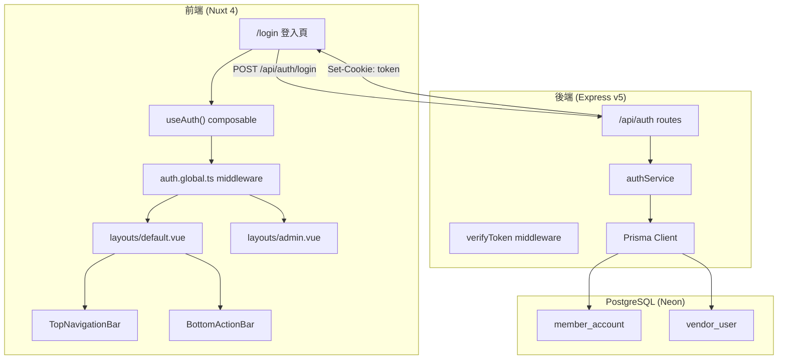
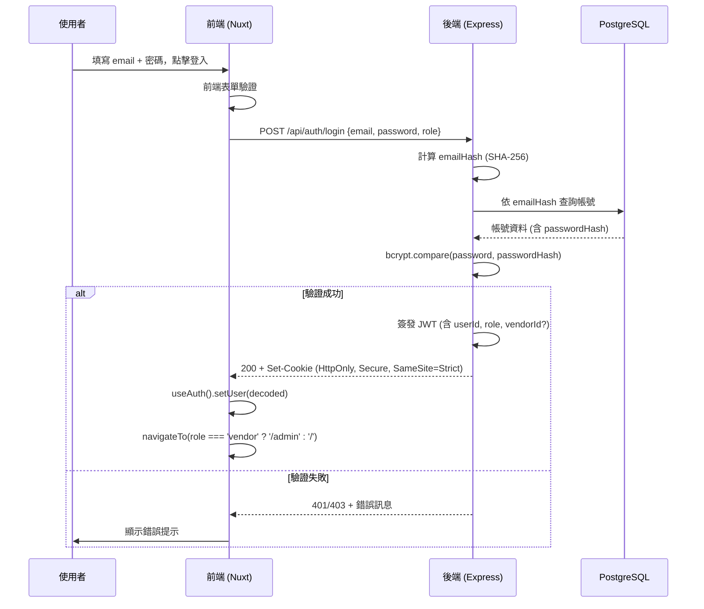

# Design Document: Auth and UI Overhaul

## Overview

本設計涵蓋「AI 生活管家」應用程式的認證系統建置與前端 UI 架構重構。系統分為兩大部分：

1. **後端認證服務**：基於 Express v5 + JWT 的雙角色（一般會員 / 廠商用戶）登入 API，包含密碼驗證、Token 簽發、Cookie 管理。
2. **前端 UI 重構**：以 Nuxt 4 middleware 實現路由守衛、重新設計導覽架構（TopNavigationBar + BottomActionBar）、重構 layouts、清理廢棄元件、重組後台管理頁面結構。

### 設計決策摘要

| 決策 | 選擇 | 理由 |
|------|------|------|
| Token 儲存方式 | HttpOnly Secure Cookie | 防止 XSS 竊取 token |
| 密碼雜湊 | bcrypt | 業界標準，內建 salt |
| JWT 簽章演算法 | HS256 | 單一服務部署，對稱加密足夠 |
| Token 驗證位置 | 後端 middleware + 前端 route guard | 雙層保護 |
| 反向地理編碼 | 政府開放資料 or Nominatim | 免費、台灣行政區精確 |

---

## Architecture

### 系統架構圖



### 請求流程（登入）



---

## Components and Interfaces

### 後端元件

#### 1. Auth Router (`backend/routes/auth.js`)

```javascript
// POST /api/auth/login
// Request body: { email: string, password: string, role: 'member' | 'vendor' }
// Response: 200 (Set-Cookie) | 401 | 403

// POST /api/auth/logout
// Response: 200 (Clear-Cookie)

// GET /api/auth/me
// Response: { userId, role, vendorId?, name? } | 401
```

#### 2. Auth Middleware (`backend/middleware/verifyToken.js`)

```javascript
// 解析 cookie 中的 JWT token
// 驗證簽章與過期時間
// 將 decoded payload 掛載至 req.user
// 驗證失敗則回傳 401
```

#### 3. Auth Service (`backend/services/authService.js`)

```javascript
// loginMember(email, password) → { token } | Error
// loginVendor(email, password) → { token } | Error
// hashEmail(email) → emailHash (SHA-256 hex)
// verifyPassword(plain, hash) → boolean
// signToken(payload, expiresIn) → JWT string
```

#### 4. Crypto Utils (`backend/utils/crypto.js`)

```javascript
// hashEmail(email) → SHA-256 hex string (用於 emailHash 查詢)
// 解密 Bytes 欄位 (AES-256-GCM，key 來自環境變數)
```

### 前端元件

#### 5. Auth Composable (`frontend/app/composables/useAuth.ts`)

```typescript
interface AuthState {
  isAuthenticated: boolean
  user: { userId: string; role: 'member' | 'vendor'; vendorId?: number; name?: string } | null
  isLoading: boolean
}

// useAuth() → {
//   state: Readonly<AuthState>
//   login(email, password, role): Promise<void>
//   logout(): Promise<void>
//   fetchUser(): Promise<void>  // GET /api/auth/me
// }
```

#### 6. Route Guard Middleware (`frontend/app/middleware/auth.global.ts`)

```typescript
// 全域 middleware，每次路由變更時執行
// - 檢查 useAuth().state.isAuthenticated
// - 未認證 → 導向 /login?redirect=原路徑
// - 角色不符 → 導向對應首頁
// - /login 頁面已登入 → 導向對應首頁
```

#### 7. TopNavigationBar (`frontend/app/components/TopNavigationBar.vue`)

```typescript
// Props: 無（內部讀取 info.json + useAuth + useGeolocation）
// 功能：
//   - 六大模組水平標籤列（可捲動）
//   - 點擊標籤展開/收合下拉選單
//   - 顯示地理位置 + 用戶名稱
//   - 下拉選單項目導航
```

#### 8. BottomActionBar (`frontend/app/components/BottomActionBar.vue`)

```typescript
// Props: 無
// 功能：
//   - 三個按鈕：個人資料、AI 聊天（圓形突出）、行事曆
//   - AI 聊天按鈕觸發 overlay
```

#### 9. Geolocation Composable (`frontend/app/composables/useGeolocation.ts`)

```typescript
// useGeolocation() → {
//   location: Ref<string>  // "台北市信義區" | "定位中..." | "未設定位置"
//   refresh(): void
// }
```

#### 10. Login Page (`frontend/app/pages/login.vue`)

```typescript
// 雙角色 Tab 切換（一般登入 / 廠商登入）
// 表單驗證（email 格式、密碼長度）
// 登入請求 → useAuth().login()
// 測試帳號顯示區塊
```

---

## Data Models

### JWT Token Payload

```typescript
// 一般會員 token
interface MemberTokenPayload {
  sub: string        // userId (UUID)
  role: 'member'
  iat: number        // 簽發時間
  exp: number        // 過期時間 (24h)
}

// 廠商用戶 token
interface VendorTokenPayload {
  sub: string        // userId (UUID)
  role: 'vendor'
  vendorId: number   // 廠商 ID
  iat: number
  exp: number        // 過期時間 (8h)
}
```

### API Request/Response 模型

```typescript
// POST /api/auth/login
interface LoginRequest {
  email: string      // 最大 254 字元
  password: string   // 8~72 字元
  role: 'member' | 'vendor'
}

interface LoginSuccessResponse {
  success: true
  user: {
    userId: string
    role: 'member' | 'vendor'
    vendorId?: number
    name?: string     // 解密後的用戶名稱
  }
}

interface LoginErrorResponse {
  success: false
  message: string    // 不揭露具體失敗原因
  code: 'INVALID_CREDENTIALS' | 'ACCOUNT_DISABLED'
}

// GET /api/auth/me
interface MeResponse {
  userId: string
  role: 'member' | 'vendor'
  vendorId?: number
  name?: string
}
```

### Cookie 配置

```typescript
const cookieOptions = {
  httpOnly: true,
  secure: true,           // HTTPS only
  sameSite: 'strict',
  path: '/',
  maxAge: role === 'member' ? 86400 : 28800  // 24h or 8h (seconds)
}
```

### 前端 Auth State

```typescript
interface AuthState {
  isAuthenticated: boolean
  user: {
    userId: string
    role: 'member' | 'vendor'
    vendorId?: number
    name?: string
  } | null
  isLoading: boolean
  error: string | null
}
```

### 檔案結構變更

```
frontend/app/
├── components/
│   ├── TopNavigationBar.vue       ← 新增
│   ├── BottomActionBar.vue        ← 新增
│   ├── AiChatOverlay.vue          ← 新增
│   └── ui/
│       ├── DashboardCard.vue      ← 保留
│       ├── ProgressBar.vue        ← 保留
│       ├── TicketWallet.vue       ← 保留
│       ├── AppHeader.vue          ← 刪除
│       ├── ModuleTab.vue          ← 刪除
│       ├── AiButton.vue           ← 刪除
│       └── RoleSwitchButton.vue   ← 刪除
├── composables/
│   ├── useAuth.ts                 ← 新增
│   ├── useGeolocation.ts          ← 新增
│   ├── useCarbonCalculator.ts     ← 保留
│   └── useTransportState.ts       ← 保留
├── middleware/
│   └── auth.global.ts             ← 新增
├── layouts/
│   ├── default.vue                ← 重構
│   └── admin.vue                  ← 更新
├── pages/
│   ├── login.vue                  ← 新增
│   ├── index.vue                  ← 保留
│   ├── admin/
│   │   ├── index.vue              ← 新增（後台首頁）
│   │   ├── food.vue               ← 從 food/admin.vue 移入
│   │   ├── medical.vue            ← 從 medical/admin.vue 移入
│   │   └── housing.vue            ← 從 housing/admin.vue 移入
│   ├── food/
│   │   └── index.vue              ← 保留（不動）
│   ├── medical/
│   │   └── index.vue              ← 保留（不動）
│   ├── housing/
│   │   └── index.vue              ← 保留（不動）
│   └── transport/
│       └── index.vue              ← 保留（不動）

backend/
├── index.js                       ← 更新（掛載 routes, cookieParser）
├── routes/
│   ├── index.js                   ← 更新（掛載 authRouter）
│   └── auth.js                    ← 新增
├── middleware/
│   └── verifyToken.js             ← 新增
├── services/
│   └── authService.js             ← 新增
└── utils/
    └── crypto.js                  ← 新增
```

---

## Error Handling

### 後端錯誤處理策略

| 場景 | HTTP Status | 回應 | 安全考量 |
|------|-------------|------|----------|
| email/密碼格式不正確 | 400 | `{ message: "輸入格式不正確" }` | 前端已驗證，此為防禦層 |
| 帳號不存在或密碼錯誤 | 401 | `{ message: "帳號或密碼錯誤" }` | 不區分哪個欄位錯誤 |
| 帳號停用 (member status≠"01") | 403 | `{ message: "帳號已停用" }` | 明確告知停用 |
| 帳號停用 (vendor isActive="0") | 403 | `{ message: "帳號已被停用" }` | 明確告知停用 |
| 帳號已刪除 (vendor isDeleted=true) | 401 | `{ message: "帳號或密碼錯誤" }` | 不揭露刪除事實 |
| Token 過期 | 401 | `{ message: "認證已過期" }` | 前端清除狀態 |
| Token 簽章無效 | 401 | `{ message: "認證無效" }` | 前端清除狀態 |
| 伺服器內部錯誤 | 500 | `{ message: "系統錯誤" }` | 不暴露內部細節 |

### 前端錯誤處理策略

1. **表單驗證錯誤**：即時顯示於欄位下方，不送出 API 請求
2. **API 回傳錯誤**：在表單上方顯示伺服器錯誤訊息，保留已填 email
3. **網路錯誤**：顯示「網路連線失敗，請稍後再試」
4. **Token 解析異常**：視為未認證，清除 cookie 並導向 /login
5. **Route Guard 錯誤**：所有非預期錯誤皆視為未認證狀態

### Geolocation 錯誤處理

| 錯誤情境 | 顯示文字 | 處理方式 |
|----------|----------|----------|
| 等待定位中 | "定位中..." | 非阻塞，UI 正常使用 |
| 用戶拒絕權限 | "未設定位置" | 不重複請求 |
| API 逾時 (>10s) | "未設定位置" | 靜默失敗 |
| 反向地理編碼失敗 | "未設定位置" | 靜默失敗 |
| 瀏覽器不支援 | "未設定位置" | 直接 fallback |

---

## Testing Strategy

### 測試工具選擇

- **前端單元/屬性測試**：Vitest + fast-check（已安裝於 devDependencies）
- **前端元件測試**：@vue/test-utils + happy-dom（已安裝）
- **後端單元測試**：Vitest（需新增 devDependency）
- **API 整合測試**：supertest

### 測試層級

#### 1. 屬性測試（Property-Based Testing）

適用於認證邏輯中的純函式部分：
- Email 格式驗證函式
- 密碼格式驗證函式
- Token payload 解析邏輯
- Route guard 路由決策邏輯

使用 `fast-check` 配合 Vitest，每個屬性測試至少 100 次迭代。

#### 2. 單元測試

- 前端：useAuth composable、useGeolocation composable
- 後端：authService 各函式、crypto utils
- 元件：TopNavigationBar 下拉選單邏輯、BottomActionBar 按鈕行為

#### 3. 整合測試

- 後端 API 端點完整流程（login success/failure scenarios）
- 前端 middleware 與 composable 的互動
- Cookie 設定與清除流程

### Property-Based Testing 配置

```typescript
// 每個屬性測試標記格式：
// Feature: auth-and-ui-overhaul, Property {N}: {property_text}

// 使用 fast-check，配置 numRuns: 100
import fc from 'fast-check'

fc.assert(
  fc.property(/* arbitraries */, (input) => {
    // property assertion
  }),
  { numRuns: 100 }
)
```

---

## Correctness Properties

*A property is a characteristic or behavior that should hold true across all valid executions of a system — essentially, a formal statement about what the system should do. Properties serve as the bridge between human-readable specifications and machine-verifiable correctness guarantees.*

### Property 1: 無效 email 格式一律被拒絕

*For any* 字串 s 若不符合基本 email 格式規則（缺少 @、缺少域名部分、或長度超過 254 字元），前端驗證函式 SHALL 回傳 false，且該字串不會被送出至後端 API。

**Validates: Requirements 1.5, 3.6**

### Property 2: 無效密碼長度一律被拒絕

*For any* 字串 s 若長度小於 8 或大於 72，前端密碼驗證函式 SHALL 回傳 false，且表單不會送出 API 請求。

**Validates: Requirements 1.5, 3.6**

### Property 3: Route Guard 未認證用戶一律導向登入頁

*For any* 路由路徑 path（排除 `/login`），若認證狀態為未認證（isAuthenticated = false），Route Guard 的決策函式 SHALL 回傳 redirect 至 `/login` 並附帶 query parameter `redirect={path}`。

**Validates: Requirements 4.1, 4.7**

### Property 4: Route Guard 角色隔離

*For any* 已認證使用者，若 role = "member" 且目標路徑以 `/admin` 開頭，Route Guard SHALL 回傳 redirect 至 `/`；若 role = "vendor" 且目標路徑不以 `/admin` 開頭且不是 `/login`，Route Guard SHALL 回傳 redirect 至 `/admin`。

**Validates: Requirements 4.3, 4.4, 5.4**

### Property 5: 已認證用戶存取登入頁一律被導走

*For any* 已認證使用者（role 為 "member" 或 "vendor"），當目標路徑為 `/login` 時，Route Guard SHALL 回傳 redirect 至該角色對應的首頁（member → `/`，vendor → `/admin`）。

**Validates: Requirements 4.6**

### Property 6: 下拉選單空 link 項目不可導航

*For any* info.json 中 features 陣列的項目，若其 link 值為空字串，TopNavigationBar 的選單項目 SHALL 被標記為 disabled 且點擊不觸發路由導航。

**Validates: Requirements 6.7**

### Property 7: 用戶名稱顯示截斷規則

*For any* 長度超過 20 字元的用戶名稱字串，TopNavigationBar 顯示的文字 SHALL 為前 20 字元加上 "…"，總長度為 21 字元。*For any* 長度不超過 20 字元的用戶名稱字串，SHALL 完整顯示。

**Validates: Requirements 12.5**

### Property 8: 認證 API 錯誤回應不洩露具體原因

*For any* 登入失敗場景（帳號不存在 OR 密碼錯誤 OR vendor 已刪除），Auth Service 回傳的錯誤訊息 SHALL 完全相同（"帳號或密碼錯誤"），使攻擊者無法區分是哪種失敗情況。

**Validates: Requirements 1.2, 2.2, 2.5**

