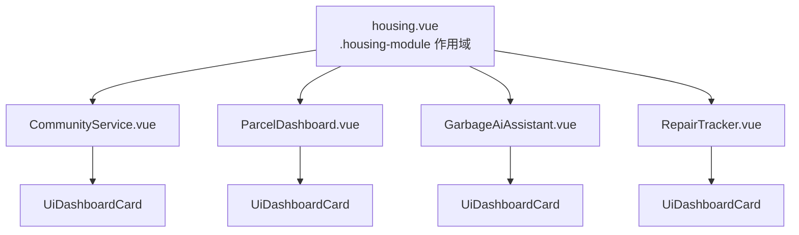

# 技術設計文件：Housing Module（住模組）

## 概覽

住模組為 AI 生活助手新增一個完整頁面，提供包裹管理、AI 垃圾分類與家事輔助、水電修繕即時追蹤、以及社區公設服務等功能。本模組嚴格遵循食模組與醫模組建立的架構模式：mobile-first 430px 容器、CSS Token 作用域覆寫、Vue refs 傳 props 管理狀態、以及 mock 資料驅動的黑客松展示模式。

**技術棧：**
- Nuxt 4（v4.5+）+ Vue 3 + TypeScript
- 元件語法：`<script setup lang="ts">`
- 樣式策略：全域 CSS Token + 元件 Scoped CSS + `.housing-module` 作用域覆寫
- 元件自動引入：Nuxt 4 Auto-import（`UiDashboardCard` 等）

**設計決策：**
- 住模組主色採用琥珀色系（`--color-primary: #d97706`），呈現暖色大地居家感，與食模組橘紅系、醫模組藍色系明確區隔。
- 次色採用青綠色（`--color-secondary: #0d9488`），用於社區公設相關操作按鈕。
- RepairTracker 採用雙狀態設計（報修表單 ↔ 派工追蹤卡片），由父頁面 `hasActiveRepair` ref 控制切換。
- GarbageAiAssistant 以 500ms setTimeout 模擬 AI 辨識延遲，無需真實 API 呼叫。
- 所有資料使用 mock hardcode（hackathon demo），無需後端 API 呼叫。
- Demo 控制面板沿用 medical.vue 固定右下角模式。

---

## 架構

### 高層次架構圖

```
Nuxt 4 Application
├── app/pages/
│   └── housing.vue                    ← 住模組頁面（.housing-module 作用域覆寫）
│
├── app/components/housing/            ← 住模組專屬元件
│   ├── CommunityService.vue           ← 社區公告與公設故障回報
│   ├── ParcelDashboard.vue            ← 包裹管理（溫層分類 + 快速操作）
│   ├── GarbageAiAssistant.vue         ← AI 垃圾分類 + 垃圾車倒數 + 大型回收預約
│   └── RepairTracker.vue              ← 報修表單 ↔ 派工追蹤雙狀態
│
├── app/components/ui/                 ← 共用 UI 元件（已存在，Auto-import）
│   ├── DashboardCard.vue
│   └── ...
│
└── app/assets/css/
    └── design-system.css              ← 全域 CSS Token（不修改）
```

### 元件依賴關係



### 資料流向

```
housing.vue (state owner)
│
├── hasActiveRepair: Ref<boolean> ──► RepairTracker (prop)
├── showClassificationResult: Ref<boolean> ──► GarbageAiAssistant (內部控制)
├── truckMinutes: Ref<number> ──► GarbageAiAssistant (prop)
├── parcels: Ref<Parcel[]> ──► ParcelDashboard (prop)
├── announcements: Ref<Announcement[]> ──► CommunityService (prop)
│
├── RepairTracker emits:
│   └── 'submit-repair' ──► housing.vue handles repair submission
│
├── GarbageAiAssistant emits:
│   └── 'submit-recycling' ──► housing.vue handles recycling booking
│
└── CommunityService emits:
    └── 'report-malfunction' ──► housing.vue handles malfunction report
```

---

## 元件與介面

### 1. housing.vue（頁面）

頁面容器，宣告所有 reactive state 並以 props 傳遞給子元件。頁面排列順序：CommunityService → ParcelDashboard → GarbageAiAssistant → RepairTracker。

```typescript
// 作用域 Token 覆寫
// .housing-module {
//   --color-primary: #d97706;          /* 琥珀色，暖色大地主色 */
//   --color-primary-light: #fffbeb;    /* 琥珀色淡底 */
//   --color-secondary: #0d9488;        /* 青綠色次色 */
//   --color-secondary-light: #ccfbf1;  /* 青綠淡底 */
// }

// State
const hasActiveRepair = ref<boolean>(true)
const showClassificationResult = ref<boolean>(false)
const truckMinutes = ref<number>(8)
```

**頁面結構草圖（ASCII）：**

```
┌─────────────────────────────────────┐  ← max-width: 430px Container
│ ┌─────────────────────────────────┐ │
│ │  COMMUNITY SERVICE               │ │  ← CommunityService.vue（頂部）
│ │  📢 社區公告                      │ │
│ │  ┌─────────────────────────────┐ │ │
│ │  │ 電梯保養通知 · 2024/01/15   │ │ │
│ │  ├─────────────────────────────┤ │ │
│ │  │ 水塔清洗公告 · 2024/01/10   │ │ │
│ │  └─────────────────────────────┘ │ │
│ │  [📷 公設故障回報]                │ │
│ └─────────────────────────────────┘ │
│                                     │
│ ┌─────────────────────────────────┐ │
│ │  PARCEL DASHBOARD                │ │  ← ParcelDashboard.vue
│ │  📦 待領包裹                      │ │
│ │  ❄️ 冷凍：鮮食宅配 [需今日領取]  │ │
│ │  🧊 冷藏：生鮮蔬果 [需今日領取]  │ │
│ │  📦 常溫：書籍包裹               │ │
│ │  ┌────┐ ┌────────┐ ┌────┐      │ │
│ │  │留言│ │代領     │ │退貨│      │ │  ← Pill 按鈕
│ │  └────┘ └────────┘ └────┘      │ │
│ └─────────────────────────────────┘ │
│                                     │
│ ┌─────────────────────────────────┐ │
│ │  GARBAGE AI ASSISTANT            │ │  ← GarbageAiAssistant.vue
│ │  🗑️ AI 垃圾分類                  │ │
│ │  [📷 拍照辨識垃圾分類]           │ │
│ │  🚛 垃圾車還有 8 分鐘到社區      │ │
│ │  ── 大型家具回收預約 ──          │ │
│ │  物品類型：[沙發 ▼]              │ │
│ │  預約日期：[2024-01-20]          │ │
│ │  [送出預約]                      │ │
│ └─────────────────────────────────┘ │
│                                     │
│ ┌─────────────────────────────────┐ │
│ │  REPAIR TRACKER                  │ │  ← RepairTracker.vue
│ │  🔧 水電修繕                      │ │
│ │  ┌─── State A: 報修表單 ───────┐ │ │
│ │  │ 故障類型：[水管漏水 ▼]       │ │ │
│ │  │ 📷 上傳照片                  │ │ │
│ │  │ [提交報修]                   │ │ │
│ │  └─────────────────────────────┘ │ │
│ │  ┌─── State B: 派工追蹤 ───────┐ │ │
│ │  │ 👨‍🔧 王師傅                    │ │ │
│ │  │ 📍 即時位置（模擬動畫）       │ │ │
│ │  │ ⏱️ 預計 15 分鐘抵達           │ │ │
│ │  │ [📞 撥打電話] [💬 傳送訊息]  │ │ │
│ │  └─────────────────────────────┘ │ │
│ └─────────────────────────────────┘ │
│                                     │
│                        ┌──────────┐ │
│                        │Demo 控制  │ │  ← fixed bottom-right
│                        │🔧切換派工 │ │
│                        │🔄 重設    │ │
│                        └──────────┘ │
└─────────────────────────────────────┘
```

### 2. CommunityService.vue

社區公告與公設故障回報。以 DashboardCard 包裝。

```typescript
interface Announcement {
  id: string
  title: string
  date: string            // YYYY-MM-DD 格式
  summary: string
}

interface CommunityServiceProps {
  announcements: Announcement[]   // 最多顯示 3 則
}

interface CommunityServiceEmits {
  'report-malfunction': []
}
```

**視覺結構：**
```
┌──────────────────────────────────┐
│ 📢 社區公告                       │
│                                  │
│ ┌──────────────────────────────┐ │
│ │ 電梯保養通知    2024/01/15    │ │
│ │ B1-1F 電梯將於週六暫停...     │ │
│ ├──────────────────────────────┤ │  ← 1px --color-border 分隔線
│ │ 水塔清洗公告    2024/01/10    │ │
│ │ 本週日凌晨 2-5 點停水...      │ │
│ └──────────────────────────────┘ │
│                                  │
│ ┌──────────────────────────────┐ │
│ │   📷 公設故障回報              │ │  ← --color-secondary 背景
│ └──────────────────────────────┘ │
└──────────────────────────────────┘
```

### 3. ParcelDashboard.vue

包裹管理區。依溫層分類顯示，提供快速操作按鈕。以 DashboardCard 包裝。

```typescript
type ParcelType = 'frozen' | 'refrigerated' | 'normal'

interface Parcel {
  id: string
  name: string
  type: ParcelType
  urgent: boolean
}

interface ParcelDashboardProps {
  parcels: Parcel[]
}

// 內部狀態：快速操作按鈕啟用/停用
const actionStates = ref<Record<string, boolean>>({
  'system-message': false,   // 系統留言替代電話
  'proxy-pickup': false,     // 7-11/智取櫃代領
  'return-send': false,      // 一鍵退貨/代發
})

// 溫層分類映射
const typeConfig: Record<ParcelType, { icon: string; label: string; colorClass: string }> = {
  frozen: { icon: '❄️', label: '冷凍', colorClass: 'parcel--frozen' },        // 藍色標記
  refrigerated: { icon: '🧊', label: '冷藏', colorClass: 'parcel--refrigerated' }, // 青色標記
  normal: { icon: '📦', label: '常溫', colorClass: 'parcel--normal' },        // 褐色標記
}
```

**視覺結構：**
```
┌──────────────────────────────────┐
│ 📦 待領包裹                       │
│                                  │
│ ❄️ 冷凍                          │
│ ┌──────────────────────────────┐ │
│ │ 鮮食宅配         [需今日領取] │ │  ← Urgency_Badge（紅底白字）
│ └──────────────────────────────┘ │
│                                  │
│ 🧊 冷藏                          │
│ ┌──────────────────────────────┐ │
│ │ 生鮮蔬果包       [需今日領取] │ │
│ └──────────────────────────────┘ │
│                                  │
│ 📦 常溫                          │
│ ┌──────────────────────────────┐ │
│ │ 書籍包裹                      │ │  ← 無 Urgency_Badge
│ └──────────────────────────────┘ │
│                                  │
│ ┌────────┐ ┌──────────┐ ┌────┐ │
│ │系統留言 │ │代領      │ │退貨│ │  ← Pill 按鈕（toggle）
│ └────────┘ └──────────┘ └────┘ │
└──────────────────────────────────┘
```

### 4. GarbageAiAssistant.vue

AI 垃圾分類辨識、垃圾車倒數、大型家具回收預約。以 DashboardCard 包裝。

```typescript
type GarbageCategory = '一般垃圾' | '資源回收' | '廚餘'

interface ClassificationResult {
  itemName: string          // 辨識物品名稱
  category: GarbageCategory // 分類類別
  suggestion: string        // 處理建議
}

interface RecyclingFormData {
  itemType: string          // 沙發/床墊/桌椅/家電/其他
  date: string              // YYYY-MM-DD
}

interface GarbageAiAssistantProps {
  truckMinutes: number      // 垃圾車倒數分鐘
}

interface GarbageAiAssistantEmits {
  'submit-recycling': [formData: RecyclingFormData]
}

// 內部狀態
const isClassifying = ref<boolean>(false)
const classificationResult = ref<ClassificationResult | null>(null)

// 模擬辨識流程
async function handleClassify() {
  isClassifying.value = true
  await new Promise(resolve => setTimeout(resolve, 500))  // 500ms 延遲
  classificationResult.value = {
    itemName: '寶特瓶',
    category: '資源回收',
    suggestion: '請清洗壓扁後投入資源回收桶，瓶蓋另外回收'
  }
  isClassifying.value = false
}

// 大型家具物品類型選項
const recyclingItemTypes = ['沙發', '床墊', '桌椅', '家電', '其他']
```

**視覺結構：**
```
┌──────────────────────────────────┐
│ 🗑️ AI 垃圾分類                    │
│                                  │
│ ┌──────────────────────────────┐ │
│ │   📷 拍照辨識垃圾分類          │ │  ← --color-primary 背景按鈕
│ └──────────────────────────────┘ │
│                                  │
│ ┌─── 辨識結果（500ms 後顯示）──┐ │
│ │ 🏷️ 寶特瓶                     │ │
│ │ 分類：資源回收                 │ │
│ │ 建議：請清洗壓扁後投入...     │ │
│ └──────────────────────────────┘ │
│                                  │
│ 🚛 垃圾車還有 8 分鐘到社區       │  ← 分鐘數紅色強調
│                                  │
│ ── 大型家具回收預約 ──            │
│ 物品類型：[沙發         ▼]       │
│ 預約日期：[2024-01-20     ]      │
│ ┌──────────────────────────────┐ │
│ │         送出預約              │ │
│ └──────────────────────────────┘ │
└──────────────────────────────────┘
```

### 5. RepairTracker.vue

水電修繕報修表單與派工即時追蹤雙狀態元件。以 DashboardCard 包裝。

```typescript
interface RepairData {
  faultType: string         // 故障類型
  photo: string             // 模擬圖片檔名
  description: string       // 問題描述
}

interface RepairTrackerProps {
  hasActiveRepair: boolean
  technicianName: string    // 師傅名稱
  etaMinutes: number        // 預估到達分鐘數
}

interface RepairTrackerEmits {
  'submit-repair': [repairData: RepairData]
}

// 故障類型選項
const faultTypes = ['水管漏水', '馬桶堵塞', '電路問題', '冷氣故障', '其他']

// 內部表單狀態
const selectedFaultType = ref<string>('')
const photoFileName = ref<string>('')
const description = ref<string>('')
```

**State A — 報修表單（hasActiveRepair = false）：**
```
┌──────────────────────────────────┐
│ 🔧 水電修繕                       │
│                                  │
│ 故障類型：                        │
│ ┌──────────────────────────────┐ │
│ │ 水管漏水                   ▼ │ │
│ └──────────────────────────────┘ │
│                                  │
│ 📷 上傳照片                       │
│ ┌──────────────────────────────┐ │
│ │ [選擇照片]  已選：leak.jpg    │ │  ← 模擬，僅顯示檔名
│ └──────────────────────────────┘ │
│                                  │
│ ┌──────────────────────────────┐ │
│ │        提交報修               │ │  ← --color-primary 背景
│ └──────────────────────────────┘ │
└──────────────────────────────────┘
```

**State B — 派工追蹤卡片（hasActiveRepair = true）：**
```
┌──────────────────────────────────┐
│ 🔧 水電修繕 · 派工追蹤            │
│                                  │
│ 👨‍🔧 王師傅                        │
│                                  │
│ 📍 ┌────────────────────────┐   │
│    │   ● （模擬定位動畫）     │   │  ← CSS 脈衝動畫圓點
│    └────────────────────────┘   │
│                                  │
│ ⏱️ 預計 15 分鐘抵達               │
│                                  │
│ ┌────────────┐  ┌────────────┐  │
│ │ 📞 撥打電話 │  │ 💬 傳送訊息 │  │  ← 外框按鈕
│ └────────────┘  └────────────┘  │
└──────────────────────────────────┘
```

### 6. RepairTracker 狀態機

```
            hasActiveRepair prop
                    │
        ┌───────────┴───────────┐
        │                       │
   false │                  true │
        ▼                       ▼
┌──────────────┐      ┌──────────────┐
│  報修表單     │      │  派工追蹤卡片  │
│  (State A)   │      │  (State B)   │
│              │      │              │
│ - 故障類型   │      │ - 師傅名稱   │
│ - 照片上傳   │      │ - 位置動畫   │
│ - 提交按鈕   │      │ - ETA 倒數   │
│              │      │ - 聯絡按鈕   │
└──────────────┘      └──────────────┘
```

---

## 資料模型

### Mock 資料結構

由於為黑客松 demo，所有資料硬編碼於 `housing.vue` 的 `<script setup>` 內：

```typescript
// housing.vue 內部 mock 資料

// 包裹清單
const parcels = ref<Parcel[]>([
  { id: 'pkg-1', name: '鮮食宅配', type: 'frozen', urgent: true },
  { id: 'pkg-2', name: '生鮮蔬果包', type: 'refrigerated', urgent: true },
  { id: 'pkg-3', name: '書籍包裹', type: 'normal', urgent: false },
])

// 社區公告
const announcements = ref<Announcement[]>([
  {
    id: 'ann-1',
    title: '電梯保養通知',
    date: '2024-01-15',
    summary: 'B1-1F 電梯將於本週六 09:00-12:00 進行年度保養，届時請改搭另一部電梯。'
  },
  {
    id: 'ann-2',
    title: '水塔清洗公告',
    date: '2024-01-10',
    summary: '本週日凌晨 2:00-5:00 進行水塔清洗作業，届時將暫停供水，請提前儲水備用。'
  },
])

// 修繕師傅資訊
const technicianName = '王師傅'
const etaMinutes = ref<number>(15)

// 響應式狀態
const hasActiveRepair = ref<boolean>(true)
const showClassificationResult = ref<boolean>(false)
const truckMinutes = ref<number>(8)
```

### GarbageAiAssistant 內部 Mock

```typescript
// GarbageAiAssistant.vue 內部 mock 辨識結果
const mockClassificationResult: ClassificationResult = {
  itemName: '寶特瓶',
  category: '資源回收',
  suggestion: '請清洗壓扁後投入資源回收桶，瓶蓋另外回收'
}
```

### CSS Token 覆寫

```css
.housing-module {
  --color-primary: #d97706;          /* 琥珀色 — 暖色大地居家感 */
  --color-primary-light: #fffbeb;    /* 琥珀色淡底 */
  --color-secondary: #0d9488;        /* 青綠色 — 社區/公設操作 */
  --color-secondary-light: #ccfbf1;  /* 青綠淡底 */
}
```

### Urgency Badge 樣式

```css
.urgency-badge {
  display: inline-flex;
  align-items: center;
  padding: 2px 8px;
  border-radius: var(--radius-full, 9999px);  /* Pill 形狀 */
  background-color: var(--color-accent-red, #e11d48);
  color: #ffffff;
  font-size: var(--text-xs, 11px);
  font-weight: 600;
  white-space: nowrap;
}
```

### 快速操作 Pill 按鈕樣式

```css
/* 停用狀態 */
.action-pill {
  padding: 6px 12px;
  border-radius: var(--radius-full, 9999px);
  border: 1px solid var(--color-border, #e2e8f0);
  background: var(--color-bg-card, #ffffff);
  color: var(--color-text-primary, #1c1917);
  font-size: var(--text-sm, 13px);
  cursor: pointer;
  transition: all 0.15s ease;
}

/* 啟用狀態 */
.action-pill--active {
  background: var(--color-primary, #d97706);
  border-color: var(--color-primary, #d97706);
  color: #ffffff;
}
```

### 派工追蹤定位動畫

```css
/* CSS 脈衝動畫模擬即時定位 */
.location-pulse {
  width: 16px;
  height: 16px;
  border-radius: 50%;
  background: var(--color-primary, #d97706);
  animation: pulse 1.5s ease-in-out infinite;
}

@keyframes pulse {
  0%, 100% { transform: scale(1); opacity: 1; }
  50% { transform: scale(1.6); opacity: 0.4; }
}
```

---

## 正確性屬性（Correctness Properties）

*屬性（Property）是一個系統在所有有效執行情境下都應成立的特性或行為——本質上是對系統應做什麼的形式化陳述。屬性在人類可讀的規格與機器可驗證的正確性保證之間架起了橋梁。*

本住模組包含部分純邏輯（分類、狀態判定、列表上限），適合以屬性測試驗證。

---

### Property 1：包裹溫層分類正確性

*對於任意*包裹陣列（包含 frozen、refrigerated、normal 三種類型的任意組合），分類函數應將每個包裹分配至對應的溫層群組中，且所有群組的包裹總數應等於輸入陣列長度（無遺漏、無重複）。

**Validates: Requirements 2.3**

---

### Property 2：緊急標示與溫層類型一致性

*對於任意* Parcel 物件，Urgency Badge 應在且僅在 `type === 'frozen' || type === 'refrigerated'` 時顯示。常溫（`type === 'normal'`）包裹不應顯示 Urgency Badge。

**Validates: Requirements 2.4**

---

### Property 3：快速操作按鈕 Toggle 冪等性

*對於任意*快速操作按鈕的初始狀態（啟用或停用），連續點擊兩次後，按鈕狀態應回到初始值。即 `toggle(toggle(state)) === state`。

**Validates: Requirements 2.6**

---

### Property 4：Repair Tracker 雙狀態互斥性

*對於任意*布林值 `hasActiveRepair`，RepairTracker 元件應精確顯示以下其中一種狀態：
- 若 `hasActiveRepair === true`，則顯示派工追蹤卡片（Dispatch Card），不顯示報修表單。
- 若 `hasActiveRepair === false`，則顯示報修表單，不顯示派工追蹤卡片。

兩種狀態不可同時顯示或同時隱藏。

**Validates: Requirements 4.5**

---

### Property 5：社區公告列表上限為 3 則

*對於任意*長度的 Announcement 陣列作為輸入，CommunityService 元件渲染的公告項目數量應始終小於或等於 3，不論輸入陣列長度為何。

**Validates: Requirements 5.3**

---

## 錯誤處理

### GarbageAiAssistant 辨識失敗

| 失敗情境 | 處理方式 | 使用者體驗 |
|---|---|---|
| 模擬辨識過程中（500ms delay） | 按鈕顯示 loading 狀態（spinner + 「辨識中...」文字），禁止重複點擊 | 使用者看到明確的等待狀態 |
| 辨識結果為空（邊界情況） | 顯示預設結果或「無法辨識，請重新拍照」 | 不會出現空白卡片 |

### RepairTracker 表單驗證

| 場景 | 處理方式 |
|---|---|
| 未選擇故障類型即提交 | 禁用提交按鈕，提示「請選擇故障類型」 |
| 未上傳照片即提交 | 允許提交（照片為選填），photo 欄位傳空字串 |
| hasActiveRepair 切換時 | 即時切換顯示狀態，無動畫延遲（v-if 條件渲染） |

### ParcelDashboard 空狀態

| 場景 | 處理方式 |
|---|---|
| parcels 陣列為空 | 顯示「🎉 目前沒有待領包裹」空狀態文字 |
| 某溫層無包裹 | 該溫層群組不渲染（v-if 過濾） |

### CommunityService 空狀態

| 場景 | 處理方式 |
|---|---|
| announcements 陣列為空 | 顯示「目前暫無社區公告」空狀態文字 |
| announcements 超過 3 則 | 僅渲染前 3 則（`slice(0, 3)`） |

### Demo 控制面板

| 操作 | 行為 |
|---|---|
| 「🔧 切換派工狀態」按鈕 | `hasActiveRepair = !hasActiveRepair`，即時切換 RepairTracker 顯示狀態 |
| 「🔄 重設」按鈕 | 恢復所有 ref 為預設值：`hasActiveRepair = true`、`showClassificationResult = false`、`truckMinutes = 8` |

---

## 測試策略

### 整體方針

住模組包含 UI 渲染元件與部分純邏輯（分類、狀態判定、列表過濾），採用**屬性測試（PBT）驗證純函數邏輯 + 例子測試驗證 UI 交互與狀態切換**的雙軌策略。

### 測試類型分類

| 類型 | 適用場景 | 工具 |
|---|---|---|
| **屬性測試（Property）** | 包裹分類、urgency 判定、toggle 冪等性、雙狀態互斥、列表上限 | Vitest + `fast-check` |
| **例子測試（Example）** | 狀態切換、emit 事件、條件渲染、按鈕點擊、表單提交 | Vitest + `@vue/test-utils` |
| **快照測試（Snapshot）** | CSS Token 套用、元件結構驗證 | Vitest + `@vue/test-utils` |

### 屬性測試配置

使用 `fast-check`（TypeScript 原生支援），每個屬性測試最少執行 **100 次**隨機迭代。

```typescript
import * as fc from 'fast-check'

// Property 1: 包裹溫層分類正確性
it('Feature: housing-module, Property 1: 包裹溫層分類正確性', () => {
  const parcelArb = fc.record({
    id: fc.uuid(),
    name: fc.string({ minLength: 1, maxLength: 20 }),
    type: fc.constantFrom('frozen', 'refrigerated', 'normal'),
    urgent: fc.boolean(),
  })

  fc.assert(
    fc.property(fc.array(parcelArb, { minLength: 0, maxLength: 50 }), (parcels) => {
      const groups = classifyByType(parcels)
      const totalGrouped = groups.frozen.length + groups.refrigerated.length + groups.normal.length
      return totalGrouped === parcels.length
    }),
    { numRuns: 100 }
  )
})

// Property 2: 緊急標示與溫層類型一致性
it('Feature: housing-module, Property 2: 緊急標示與溫層類型一致性', () => {
  fc.assert(
    fc.property(
      fc.constantFrom('frozen', 'refrigerated', 'normal'),
      (type) => {
        const shouldShowBadge = shouldDisplayUrgencyBadge(type)
        return shouldShowBadge === (type === 'frozen' || type === 'refrigerated')
      }
    ),
    { numRuns: 100 }
  )
})

// Property 3: Toggle 冪等性
it('Feature: housing-module, Property 3: 快速操作按鈕 Toggle 冪等性', () => {
  fc.assert(
    fc.property(fc.boolean(), (initialState) => {
      const afterFirst = !initialState
      const afterSecond = !afterFirst
      return afterSecond === initialState
    }),
    { numRuns: 100 }
  )
})

// Property 4: 雙狀態互斥性
it('Feature: housing-module, Property 4: Repair Tracker 雙狀態互斥性', () => {
  fc.assert(
    fc.property(fc.boolean(), (hasActiveRepair) => {
      const showForm = !hasActiveRepair
      const showDispatch = hasActiveRepair
      return showForm !== showDispatch  // 互斥
    }),
    { numRuns: 100 }
  )
})

// Property 5: 社區公告列表上限
it('Feature: housing-module, Property 5: 社區公告列表上限為 3 則', () => {
  const announcementArb = fc.record({
    id: fc.uuid(),
    title: fc.string({ minLength: 1, maxLength: 30 }),
    date: fc.date().map(d => d.toISOString().slice(0, 10)),
    summary: fc.string({ minLength: 1, maxLength: 100 }),
  })

  fc.assert(
    fc.property(fc.array(announcementArb, { minLength: 0, maxLength: 50 }), (announcements) => {
      const rendered = limitAnnouncements(announcements)
      return rendered.length <= 3
    }),
    { numRuns: 100 }
  )
})
```

### 單元測試重點覆蓋

| 元件 | 測試重點 | 數量建議 |
|---|---|---|
| `CommunityService` | 公告列表渲染、分隔線、空狀態、emit report-malfunction | 4 個例子 + 屬性測試 |
| `ParcelDashboard` | 溫層分類顯示、Urgency Badge 條件、Pill 按鈕 toggle、空狀態 | 4 個例子 + 屬性測試 |
| `GarbageAiAssistant` | 辨識按鈕 loading、結果卡片顯示、倒數顯示、表單 emit | 4 個例子 |
| `RepairTracker` | 雙狀態切換、表單提交 emit、Dispatch Card 資訊顯示、按鈕渲染 | 4 個例子 + 屬性測試 |
| `housing.vue` | Demo 控制面板切換、元件排列順序、Token 覆寫 | 3 個例子 |

### 標注格式

每個屬性測試必須包含以下註釋標記：

```typescript
// Feature: housing-module, Property {N}: {property_text}
```

### 無障礙驗證

- 所有按鈕設定 `aria-label`（例如：「拍照辨識垃圾分類」、「提交報修」、「撥打電話聯繫師傅」）
- 表單元素具備 `<label>` 關聯
- Urgency Badge 使用 `role="status"` 與 `aria-live="polite"` 通知螢幕閱讀器
- 焦點外框：所有可互動元素 focus 時顯示 `outline: 2px solid var(--color-primary)`
- 注意：完整的無障礙驗證需要搭配實際螢幕閱讀器（NVDA / VoiceOver）進行手動測試
