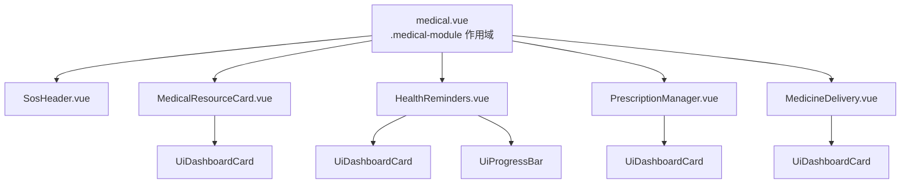

# 技術設計文件：Medical Module（醫 Module）

## 概覽

醫療模組為 AI 生活助手新增一個完整頁面，提供緊急求助、附近醫療資源探索、AI 診斷建議、每日健康管理、處方/藥物辨識，以及送藥追蹤等功能。本模組嚴格遵循食模組建立的架構模式：mobile-first 430px 容器、CSS Token 作用域覆寫、BEM-like `.mc__*` 命名、Vue refs 傳 props 管理狀態、以及 mock 資料驅動的黑客松展示模式。

**技術棧：**
- Nuxt 4（v4.5+）+ Vue 3 + TypeScript
- 元件語法：`<script setup lang="ts">`
- 樣式策略：全域 CSS Token + 元件 Scoped CSS + `.medical-module` 作用域覆寫
- 元件自動引入：Nuxt 4 Auto-import（`UiDashboardCard`、`UiProgressBar` 等）

**設計決策：**
- 醫療模組主色採用藍色系（`--color-primary: #2563eb`），與食模組橘紅系區分，同時紅色保留給 SOS 緊急區塊使用。
- SOS 區塊獨立於 DashboardCard 體系外，使用自有紅底樣式以強調緊急性。
- State A/B 切換（醫療資源 ↔ AI 診斷）由父頁面控制 `isAiTriggered` ref，子元件被動接收 prop。
- 送藥追蹤採用 4-step 線性進度條模式，無需複雜狀態機。
- 所有資料使用 mock hardcode（hackathon demo），無需後端 API 呼叫。

---

## 架構

### 高層次架構圖

```
Nuxt 4 Application
├── app/pages/
│   └── medical.vue                    ← 醫療模組頁面（.medical-module 作用域覆寫）
│
├── app/components/medical/            ← 醫療模組專屬元件
│   ├── SosHeader.vue                  ← 緊急求助區塊（119 + 緊急聯絡人 + GPS）
│   ├── MedicalResourceCard.vue        ← 雙狀態卡片（State A: 資源列表/地圖 | State B: AI 診斷）
│   ├── HealthReminders.vue            ← 每日健康追蹤（飲水/維生素/健康小提示）
│   ├── PrescriptionManager.vue        ← 處方上傳 + 慢性病用藥 + 藥物查詢
│   └── MedicineDelivery.vue           ← 外送平台整合 + 訂單追蹤
│
├── app/components/ui/                 ← 共用 UI 元件（已存在，Auto-import）
│   ├── DashboardCard.vue
│   ├── ProgressBar.vue
│   └── ...
│
└── app/assets/css/
    └── design-system.css              ← 全域 CSS Token（不修改）
```

### 元件依賴關係



### 資料流向

```
medical.vue (state owner)
│
├── isAiTriggered: Ref<boolean> ──► MedicalResourceCard (prop)
├── viewMode: Ref<'list' | 'map'> ──► MedicalResourceCard (prop)
├── hasDeliveryOrder: Ref<boolean> ──► MedicineDelivery (prop)
│
├── MedicalResourceCard emits:
│   ├── 'update:viewMode' ──► medical.vue updates viewMode
│   ├── 'dismiss-ai' ──► medical.vue sets isAiTriggered = false
│   └── 'book-appointment' ──► medical.vue handles navigation
│
└── MedicineDelivery emits:
    └── 'order-confirmed' ──► medical.vue sets hasDeliveryOrder = true
```

---

## 元件與介面

### 1. medical.vue（頁面）

頁面容器，宣告所有 reactive state 並以 props 傳遞給子元件。

```typescript
// 作用域 Token 覆寫
// .medical-module {
//   --color-primary: #2563eb;        /* 藍色主色 */
//   --color-primary-light: #eff6ff;  /* 藍色淡底 */
//   --color-secondary: #16a34a;      /* 綠色次色（健康/完成） */
//   --color-secondary-light: #dcfce7;
// }

// State
const isAiTriggered = ref<boolean>(false)
const viewMode = ref<'list' | 'map'>('list')
const hasDeliveryOrder = ref<boolean>(false)
```

### 2. SosHeader.vue

緊急求助區塊。獨立紅底樣式，不使用 DashboardCard 包裝。

```typescript
interface SosHeaderProps {
  emergencyContact?: string   // 緊急聯絡人電話號碼，未設定時隱藏/禁用按鈕
}

// 內部狀態
const gpsCoords = ref<{ lat: number; lng: number } | null>(null)
const gpsError = ref<boolean>(false)

// 生命週期：onMounted 時呼叫 navigator.geolocation.getCurrentPosition
// options: { timeout: 10000 }
// 成功 → gpsCoords.value = { lat, lng }
// 失敗 → gpsError.value = true
```

**視覺結構：**
```
┌────────────────────────────────────┐  ← 紅底圓角卡片
│  🚨 緊急求助                        │
│                                    │
│  📍 25.0330, 121.5654 (或「定位中...」) │
│                                    │
│  ┌──────────┐  ┌──────────────┐   │
│  │ 📞 撥打119 │  │ 👤 緊急聯絡人  │   │  ← 48×48 最小觸控目標
│  └──────────┘  └──────────────┘   │
└────────────────────────────────────┘
```

### 3. MedicalResourceCard.vue

雙狀態卡片：State A（醫療資源列表/地圖）↔ State B（AI 診斷建議）。

```typescript
interface Facility {
  id: string
  name: string
  type: 'clinic' | 'pharmacy'
  distance: number          // km，用於排序
  distanceLabel: string     // "X.X km" 格式化顯示
  department?: string       // 科別（診所）
}

interface DiagnosisResult {
  conditionName: string     // 最多 50 字
  description: string       // 最多 200 字
  suggestedDepartment: string
}

interface AppointmentForm {
  name: string
  phone: string
  condition: string
}

interface MedicalResourceCardProps {
  isAiTriggered: boolean
  viewMode: 'list' | 'map'
  diagnosisResult?: DiagnosisResult
  prefillData?: { name: string; phone: string; condition: string }
}

interface MedicalResourceCardEmits {
  'update:viewMode': [mode: 'list' | 'map']
  'dismiss-ai': []
  'book-appointment': [facilityId: string]
  'submit-appointment': [form: AppointmentForm]
}

// 表單驗證規則
// name: 1-50 字元，非空
// phone: 7-15 位數字
// condition: 1-200 字元，非空
```

**State A 視覺結構：**
```
┌──────────────────────────────────┐
│ 📋 附近醫療資源                    │
│                                  │
│ [📋 列表模式] [🗺️ 地圖模式]       │  ← 切換 tabs
│                                  │
│ ┌──────────────────────────────┐ │  ← viewMode === 'list'
│ │ 🏥 台大醫院 · 診所 · 0.5 km   │ │
│ │                    [線上預約] │ │
│ ├──────────────────────────────┤ │
│ │ 💊 康是美 · 藥局 · 0.8 km     │ │
│ │                    [線上預約] │ │
│ └──────────────────────────────┘ │
└──────────────────────────────────┘
```

**State B 視覺結構：**
```
┌──────────────────────────────────┐
│ 🤖 AI 診斷建議          [返回列表] │
│                                  │
│ ┌──────────────────────────────┐ │
│ │ 症狀：季節性過敏性鼻炎         │ │
│ │ 說明：鼻塞、打噴嚏、眼睛癢... │ │
│ │ 建議科別：耳鼻喉科             │ │
│ └──────────────────────────────┘ │
│                                  │
│ ✨ AI 已為你預填掛號資料          │
│ 👤 姓名：[陳小明]                 │
│ 📞 電話：[0912345678]            │
│ 🩺 症狀：[季節性過敏性鼻炎]       │
│                                  │
│ [   確認預約掛號   ]              │
└──────────────────────────────────┘
```

### 4. HealthReminders.vue

每日健康追蹤：飲水量進度、維生素提醒、健康小提示。

```typescript
interface VitaminReminder {
  name: string              // 最多 50 字
  time: string              // HH:mm 24小時格式
}

interface HealthRemindersProps {
  waterIntake: number       // 當日已飲水量 (ml)
  waterGoal?: number        // 每日目標，預設 2000 ml
  vitamins: VitaminReminder[]  // 1-10 筆
  healthTip: string         // 今日健康小提示，最多 200 字
}
```

**視覺結構：**
```
┌──────────────────────────────────┐
│ 💧 今日飲水                        │
│ ████████░░░░░░░░░░  800 / 2000 ml │  ← UiProgressBar
│                                  │
│ 💊 維生素提醒                      │
│ ┌──────────────────────────────┐ │
│ │ 維生素 D         08:00        │ │
│ │ 魚油             12:00        │ │
│ │ 鈣片             20:00        │ │
│ └──────────────────────────────┘ │
│                                  │
│ 💡 今日健康提示                    │
│ ┌──────────────────────────────┐ │
│ │ 每天曬 15 分鐘太陽有助於...    │ │
│ └──────────────────────────────┘ │
└──────────────────────────────────┘
```

### 5. PrescriptionManager.vue

處方上傳、慢性病用藥管理、藥物名稱查詢。

```typescript
interface Medication {
  id: string
  name: string              // 藥品名稱
  dosage: string            // 單次劑量，例如 "500mg"
  schedule: string          // 服用時程，例如 "每日 2 次，早晚飯後"
}

interface DrugSearchResult {
  name: string
  dosageForm: string        // 劑型，例如 "錠劑" / "膠囊"
  image: string             // emoji 或圖片 URL
}

interface PrescriptionManagerProps {
  medications: Medication[] // 最多 20 筆
}

interface PrescriptionManagerEmits {
  'upload-prescription': [file: File]
  'search-drug': [keyword: string]
}

// 檔案驗證規則
// 格式：JPEG, PNG, HEIC
// 大小上限：10MB (10 * 1024 * 1024 bytes)

// 藥物搜尋規則
// 最少輸入 1 字元觸發搜尋
// 最多顯示 10 筆結果
```

**視覺結構：**
```
┌──────────────────────────────────┐
│ 📋 處方管理                       │
│                                  │
│ 📷 上傳處方箋                     │
│ ┌──────────────────────────────┐ │
│ │   [拍照] / [從相簿選取]       │ │
│ └──────────────────────────────┘ │
│                                  │
│ 💊 慢性病用藥提醒                  │
│ ┌──────────────────────────────┐ │
│ │ 降血壓藥 · 10mg · 每日1次早餐後│ │
│ │ 降血糖藥 · 500mg · 每日2次    │ │
│ └──────────────────────────────┘ │
│                                  │
│ 🔍 藥物查詢                       │
│ ┌──────────────────────────────┐ │
│ │ [輸入藥物名稱...]              │ │
│ │ ┌────────────────────────┐   │ │
│ │ │ 普拿疼 · 錠劑 · 💊     │   │ │
│ │ │ 百服寧 · 膠囊 · 💊     │   │ │
│ │ └────────────────────────┘   │ │
│ └──────────────────────────────┘ │
└──────────────────────────────────┘
```

### 6. MedicineDelivery.vue

外送藥局平台整合與訂單追蹤。

```typescript
type DeliveryStage = 1 | 2 | 3 | 4
// 1: 藥師調劑中
// 2: 平台外送員接單
// 3: 配送中
// 4: 已送達

interface MedicineDeliveryProps {
  hasDeliveryOrder: boolean
  currentStage?: DeliveryStage    // 1-4
  estimatedMinutes?: number       // 預計送達分鐘數
}

interface MedicineDeliveryEmits {
  'order-confirmed': []
  'open-platform': []
}
```

**State: 無訂單（partner card）：**
```
┌──────────────────────────────────┐
│ 🚚 合作外送藥局平台                │
│                                  │
│ 與合作藥局連線，處方藥品直送到家    │
│                                  │
│ [   前往外送平台   ]              │
└──────────────────────────────────┘
```

**State: 有訂單（tracking）：**
```
┌──────────────────────────────────┐
│ 🚚 送藥進度                       │
│                                  │
│ ●────●────◐────○                 │
│ 調劑  接單  配送  送達             │
│                                  │
│ 預計 25 分鐘送達                   │
└──────────────────────────────────┘
```

---

## 資料模型

### Mock 資料結構

由於為黑客松 demo，所有資料硬編碼於各元件 `<script setup>` 內：

```typescript
// MedicalResourceCard 內部 mock
const facilities: Facility[] = [
  { id: 'ntu-hospital', name: '台大醫院', type: 'clinic', distance: 0.5, distanceLabel: '0.5 km', department: '家醫科' },
  { id: 'cosmed-xinyi', name: '康是美 信義店', type: 'pharmacy', distance: 0.8, distanceLabel: '0.8 km' },
  { id: 'mackay-hospital', name: '馬偕醫院', type: 'clinic', distance: 1.2, distanceLabel: '1.2 km', department: '內科' },
  { id: 'watsons-101', name: '屈臣氏 101店', type: 'pharmacy', distance: 1.5, distanceLabel: '1.5 km' },
]

// HealthReminders 內部 mock
const mockVitamins: VitaminReminder[] = [
  { name: '維生素 D', time: '08:00' },
  { name: '魚油 Omega-3', time: '12:00' },
  { name: '鈣片', time: '20:00' },
]

// PrescriptionManager 內部 mock
const mockMedications: Medication[] = [
  { id: 'med-1', name: '降血壓藥 Amlodipine', dosage: '10mg', schedule: '每日 1 次，早餐後' },
  { id: 'med-2', name: '降血糖藥 Metformin', dosage: '500mg', schedule: '每日 2 次，早晚飯後' },
]

// AI 診斷 mock
const mockDiagnosis: DiagnosisResult = {
  conditionName: '季節性過敏性鼻炎',
  description: '根據您描述的症狀（鼻塞、打噴嚏、流鼻水、眼睛癢），初步判斷可能為季節性過敏反應，建議就診耳鼻喉科進一步確認。',
  suggestedDepartment: '耳鼻喉科',
}
```

### 表單驗證模型

```typescript
interface ValidationRule {
  field: string
  validate: (value: string) => boolean
  message: string
}

const appointmentValidationRules: ValidationRule[] = [
  { field: 'name', validate: (v) => v.trim().length >= 1 && v.trim().length <= 50, message: '姓名為必填，長度 1-50 字元' },
  { field: 'phone', validate: (v) => /^\d{7,15}$/.test(v), message: '電話為必填，7-15 位數字' },
  { field: 'condition', validate: (v) => v.trim().length >= 1 && v.trim().length <= 200, message: '症狀描述為必填，長度 1-200 字元' },
]
```

### 檔案驗證模型

```typescript
const ALLOWED_MIME_TYPES = ['image/jpeg', 'image/png', 'image/heic']
const MAX_FILE_SIZE = 10 * 1024 * 1024  // 10MB

function validatePrescriptionFile(file: File): { valid: boolean; error?: string } {
  if (!ALLOWED_MIME_TYPES.includes(file.type)) {
    return { valid: false, error: '僅支援 JPEG、PNG、HEIC 格式' }
  }
  if (file.size > MAX_FILE_SIZE) {
    return { valid: false, error: '檔案大小不可超過 10MB' }
  }
  return { valid: true }
}
```

### CSS Token 覆寫

```css
.medical-module {
  --color-primary: #2563eb;          /* 藍色主色 — 醫療專業感 */
  --color-primary-light: #eff6ff;    /* 藍色淡底 */
  --color-secondary: #16a34a;        /* 綠色次色 — 健康/完成 */
  --color-secondary-light: #dcfce7;  /* 綠色淡底 */
}
```

---

## 正確性屬性（Correctness Properties）

*屬性（Property）是一個系統在所有有效執行情境下都應成立的特性或行為——本質上是對系統應做什麼的形式化陳述。屬性在人類可讀的規格與機器可驗證的正確性保證之間架起了橋梁。*

---

### Property 1：設施列表上限為 20 筆

*對於任意*長度的醫療設施陣列作為輸入，元件渲染的列表項目數量應始終小於或等於 20，不論輸入陣列長度為何。

**Validates: Requirements 3.3, 3.4**

---

### Property 2：每筆設施條目包含所有必要欄位

*對於任意*有效的 Facility 物件，渲染後的列表項目應包含設施名稱、設施類型（診所/藥局）、距離標籤、以及線上預約按鈕四個元素。

**Validates: Requirements 3.5**

---

### Property 3：設施列表按距離升冪排序

*對於任意*設施陣列（包含不同距離值），渲染後的列表模式中每筆設施的距離值應嚴格不遞減（即 distance[i] <= distance[i+1]，對所有相鄰項成立）。

**Validates: Requirements 3.8**

---

### Property 4：預約表單驗證正確接受與拒絕

*對於任意*字串組合 (name, phone, condition)：
- 若 name 長度為 1-50 字元（去除頭尾空白後）、phone 為 7-15 位純數字、condition 長度為 1-200 字元（去除頭尾空白後），則驗證函數應回傳有效。
- 若上述任一條件不滿足，則驗證函數應回傳無效，且指出具體的無效欄位。

**Validates: Requirements 4.5, 4.6**

---

### Property 5：飲水量進度百分比計算

*對於任意*非負整數 waterIntake 與正整數 waterGoal，計算出的百分比應等於 `Math.min(100, Math.max(0, (waterIntake / waterGoal) * 100))`，且當 waterIntake > waterGoal 時，overLimit 旗標應為 true。

**Validates: Requirements 5.1, 5.5**

---

### Property 6：處方檔案驗證

*對於任意*檔案（具有 type 與 size 屬性），驗證函數應在且僅在 type 屬於 ['image/jpeg', 'image/png', 'image/heic'] 且 size <= 10MB 時回傳有效；否則回傳無效並附帶對應錯誤訊息。

**Validates: Requirements 6.1**

---

### Property 7：慢性病用藥列表上限為 20 筆

*對於任意*長度的 Medication 陣列，元件渲染的列表項目數量應始終小於或等於 20，且每筆項目應包含藥品名稱、劑量、服用時程三個欄位。

**Validates: Requirements 6.2**

---

### Property 8：藥物搜尋結果上限為 10 筆且包含必要欄位

*對於任意*非空搜尋關鍵字（1 字元以上）與任意長度的藥物資料庫，回傳的搜尋結果數量應小於或等於 10，且每筆結果應包含藥品名稱、劑型、參考圖片三個欄位。

**Validates: Requirements 6.3**

---

### Property 9：送藥追蹤進度階段正確性

*對於任意* DeliveryStage 值 S（1-4），進度追蹤器應：
- 將階段 1 至 S-1 標記為已完成（done 樣式）
- 將階段 S 標記為當前進行中（highlighted 樣式）
- 將階段 S+1 至 4 標記為待處理（muted 樣式）

**Validates: Requirements 7.3**

---

## 錯誤處理

### Geolocation API 失敗

| 失敗情境 | 處理方式 | 使用者體驗 |
|---|---|---|
| 使用者拒絕定位權限 | `gpsError = true`，顯示「📍 無法取得位置」 | SOS 區塊仍可正常使用撥打功能 |
| API 超時（> 10s） | 同上 | 同上 |
| 瀏覽器不支援 Geolocation | `navigator.geolocation` 不存在時直接設 error | 同上 |

### 處方上傳失敗

| 失敗情境 | 處理方式 |
|---|---|
| 檔案格式不支援 | 顯示行內錯誤「僅支援 JPEG、PNG、HEIC 格式」，不清除已選檔案 |
| 檔案超過 10MB | 顯示行內錯誤「檔案大小不可超過 10MB」 |
| 處理超時（> 10s） | 顯示錯誤提示「處理失敗，請重新拍照或上傳」，提供重試按鈕 |

### 表單驗證失敗

| 欄位 | 驗證失敗訊息 | 行為 |
|---|---|---|
| 姓名 | 「姓名為必填，長度 1-50 字元」 | 欄位下方紅色文字提示，其他欄位保留值 |
| 電話 | 「電話為必填，7-15 位數字」 | 同上 |
| 症狀 | 「症狀描述為必填，長度 1-200 字元」 | 同上 |

### 空狀態處理

| 場景 | 顯示內容 |
|---|---|
| 5 km 內無醫療設施 | 「附近沒有找到醫療設施，請嘗試擴大搜尋範圍」 |
| 藥物搜尋無結果 | 「找不到符合的藥物，請確認關鍵字」 |
| 維生素提醒列表為空 | 「尚未設定維生素提醒」 |

---

## 測試策略

### 整體方針

醫療模組包含 UI 渲染元件與純邏輯函數（驗證、計算、排序、過濾），採用**屬性測試（PBT）驗證純函數邏輯 + 例子測試驗證 UI 交互與狀態切換**的雙軌策略。

### 測試類型分類

| 類型 | 適用場景 | 工具 |
|---|---|---|
| **屬性測試（Property）** | 表單驗證、檔案驗證、列表上限/排序、進度計算、搜尋過濾 | Vitest + `fast-check` |
| **例子測試（Example）** | 狀態切換、emit 事件、條件渲染、Geolocation mock | Vitest + `@vue/test-utils` |
| **快照測試（Snapshot）** | CSS Token 套用、BEM class 結構驗證 | Vitest + `@vue/test-utils` |

### 屬性測試配置

使用 `fast-check`（TypeScript 原生支援），每個屬性測試最少執行 **100 次**隨機迭代。

```typescript
import * as fc from 'fast-check'

// Property 4: 表單驗證
it('Feature: medical-module, Property 4: 預約表單驗證正確接受與拒絕', () => {
  fc.assert(
    fc.property(
      fc.string({ minLength: 1, maxLength: 50 }),   // valid name
      fc.stringOf(fc.constantFrom(...'0123456789'.split('')), { minLength: 7, maxLength: 15 }), // valid phone
      fc.string({ minLength: 1, maxLength: 200 }),  // valid condition
      (name, phone, condition) => {
        const result = validateAppointmentForm({ name, phone, condition })
        return result.valid === true
      }
    ),
    { numRuns: 100 }
  )
})

// Property 6: 檔案驗證
it('Feature: medical-module, Property 6: 處方檔案驗證', () => {
  fc.assert(
    fc.property(
      fc.constantFrom('image/jpeg', 'image/png', 'image/heic'),
      fc.integer({ min: 1, max: 10 * 1024 * 1024 }),
      (type, size) => {
        const result = validatePrescriptionFile({ type, size } as File)
        return result.valid === true
      }
    ),
    { numRuns: 100 }
  )
})
```

### 單元測試重點覆蓋

| 元件 | 測試重點 | 數量建議 |
|---|---|---|
| `SosHeader` | tel:119 href、緊急聯絡人按鈕顯示/隱藏、GPS mock 成功/失敗 | 4 個例子 |
| `MedicalResourceCard` | State A/B 切換、viewMode 切換、空狀態、表單提交 | 5 個例子 + 屬性測試 |
| `HealthReminders` | 飲水進度顯示、維生素列表渲染、overLimit 樣式 | 3 個例子 + 屬性測試 |
| `PrescriptionManager` | 檔案上傳驗證、搜尋觸發（1字元）、無結果狀態 | 4 個例子 + 屬性測試 |
| `MedicineDelivery` | partner card 狀態、tracking 狀態、modal 開關、階段高亮 | 4 個例子 + 屬性測試 |

### 標注格式

每個屬性測試必須包含以下註釋標記：

```typescript
// Feature: medical-module, Property {N}: {property_text}
```

### 無障礙驗證

- SOS 按鈕確保 `aria-label` 清楚表達行為（「撥打 119 急救電話」）
- 所有可點擊元素最小 48×48 CSS pixels 觸控目標
- 表單欄位具備 `<label>` 與 `aria-describedby` 關聯錯誤訊息
- 進度追蹤器使用 `role="progressbar"` 或 `aria-current="step"` 標注
